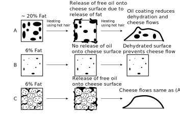

---
press:
  subtitle: >
    A Rheological Study on the Viscoelastic Properties of Aged Cheese Varieties
  authors:
    - name: Dr. Jane Q. Dairy
      affiliation: Department of Food Mechanics, University of Edam, Netherlands
    - name: Dr. John P. Curds
      affiliation: Institute of Rheological Science, Swiss Cheese Laboratory
  date: Octobrer 20, 2025
  slots:
    abstract: Abstract
bibliography:
  WADHWANI20111713: https://doi.org/10.3168/jds.2010-3952

---
# Mechanical Stiffness and Malleability of Hard Cheese

## Abstract

The mechanical behavior of hard cheese varieties is a key determinant of their
processing characteristics, textural perception, and overall quality. This study
investigates the stiffness and malleability of aged cheeses by combining
rheological theory and experimental measurements. A viscoelastic constitutive
model is used to describe the dependence of the elastic modulus on strain rate
and temperature. Compression tests were conducted on Parmigiano-Reggiano, Comté,
and aged Cheddar under controlled conditions. The results demonstrate significant
variability among cheese types, primarily influenced by moisture and fat content.
Computational modeling using Python highlights the predictive capability of the
proposed formulation. The findings provide a quantitative framework for linking
the microstructure of hard cheeses to their macroscopic mechanical response.

## Introduction

Cheese, though traditionally perceived as a food product, can also be regarded
as a **soft viscoelastic solid**, whose rheological response depends on both time
and temperature. The interplay between its **elastic stiffness** --- resistance
to deformation --- and **malleability** --- the capacity to deform without
fracture --- defines its sensory and functional attributes [^Prentice1993].

The mechanical performance of hard cheeses arises from their intricate
**protein–fat–moisture matrix**. Protein cross-linking, crystalline calcium
phosphate domains, and residual fat globules act as reinforcing or plasticizing
agents depending on aging and composition [^Jaoac2019]. Understanding these
parameters is crucial not only for consumer perception (texture, crumble,
brittleness) but also for industrial operations such as slicing, shredding,
and packaging.

This work presents an integrated experimental–computational approach to quantify
the rheological stiffness and malleability of hard cheese varieties, using an
empirical viscoelastic model to rationalize observed behavior across temperature
and strain-rate ranges.

## Theoretical Framework

The elastic modulus $E$ of a viscoelastic food material is modeled as a function
of strain rate $\dot{\varepsilon}$ and temperature $T$:

$$
E(T, \dot{\varepsilon}) = E_0 \left( 1 - \alpha (T - T_0) \right)
\left( 1 + \beta \ln \frac{\dot{\varepsilon}}{\dot{\varepsilon}_0} \right)
$$

where:

* $E_0$: reference modulus at temperature $T_0$,
* $\alpha$: thermal softening coefficient,
* $\beta$: strain-rate sensitivity coefficient.

Equation (1) assumes linear viscoelasticity and moderate deformation, conditions
generally valid below the yield point of hard cheese. Increasing temperature
reduces stiffness via thermally activated molecular mobility, whereas higher
strain rates enhance stiffness due to time-dependent stress relaxation suppression.

The **malleability**, defined here as the reciprocal of stiffness, becomes:

$$
M = \frac{1}{E(T, \dot{\varepsilon})}
$$

This formalism provides a convenient means to estimate the flexibility of cheese
under various thermal–mechanical conditions, offering a bridge between empirical
texture measurements and predictive modeling.

## Melting and Thermal Behavior

The melting characteristics of cheese are governed primarily by **fat content**,
**moisture level**, and the degree of **protein–fat network entanglement**. Hard
cheeses typically display a melting range between **50 °C and 70 °C**, depending
on composition and aging.

Thermal analysis using **Differential Scanning Calorimetry (DSC)** allows the
determination of onset and peak melting temperatures. In contrast, high-moisture
cheeses such as Mozzarella [^1] exhibit lower melting points and greater
stretchability due to reduced protein cross-link density [^WADHWANI20111713].
The figure [](#melting-behavior) illustrates the melting behavior of Mozzarella
cheese, highlighting its unique rheological response upon heating.

{ width=80% }

/// figure-caption
    attrs: {id: melting-behavior}
Melting behavior of high-moisture cheese (Mozzarella) illustrating stretchability
upon heating
///

## Materials and Methods

### Samples Preparation

Three commercial hard cheese types were selected for analysis [](#cheese-samples).
Cylindrical specimens (20 mm diameter × 20 mm height) were extracted from the core
regions and equilibrated at **10 °C** for 12 h prior to testing to minimize
moisture gradients.

| Cheese Type         | Age (months) | Moisture Content (%) | Fat Content (%) |
| ------------------- | ------------ | -------------------- | --------------- |
| Parmigiano-Reggiano | 24           | 29                   | 31              |
| Comté               | 18           | 33                   | 30              |
| Cheddar             | 12           | 36                   | 32              |

/// table-caption
    attrs: {id: cheese-samples}
Characteristics of hard cheese samples used in the study
///

### Mechanical Testing

Compression tests were carried out using a **TA-XT2 texture analyzer** equipped
with a 50 kg load cell. Specimens were compressed at three nominal strain rates
(0.1, 1, and 10 s⁻¹) to 20 % strain. The **elastic modulus (E)** was obtained
from the initial linear region (0–5 % strain) of the stress–strain curve. The
table [](#mechanical-results) summarizes the measured moduli.

| Cheese Type         | Strain Rate (s⁻¹) | Temperature (°C) | Elastic Modulus E (MPa) |
| ------------------- | ----------------: | ---------------: | ----------------------: |
| Parmigiano-Reggiano |               0.1 |               10 |                    52.1 |
| Parmigiano-Reggiano |                10 |               10 |                    66.8 |
| Comté               |               0.1 |               10 |                    44.2 |
| Cheddar             |               0.1 |               10 |                    38.7 |

/// table-caption
    attrs: {id: mechanical-results}
Measured elastic moduli of hard cheese samples at varying strain rates
///

The increasing modulus with strain rate reflects the time-dependent viscoelastic
response typical of aged dairy matrices.

## Computational Modeling

To illustrate the relationship between stiffness, temperature, and deformation
rate, the theoretical expression (Eq. 1) was implemented in **Python** as follows:

``` python linenums="1"
--8<--- "examples/paper/code.py"
```

This computational approach allows the parametric exploration of cheese stiffness
under varying conditions, offering predictive insight into texture control
during processing.

## Discussion

The results corroborate the expected hierarchy of stiffness among hard cheeses,
with **Parmigiano-Reggiano** exhibiting the highest elastic modulus, consistent
with its lower moisture and greater protein cross-linking. The **Comté** sample
demonstrated intermediate stiffness, while **Cheddar**, being relatively younger
and moister, showed greater malleability.

The positive strain-rate dependence (via $\beta > 0$) implies that cheese behaves
more elastically under rapid deformation, an important consideration for high-speed
industrial slicing. Conversely, the temperature dependence ($\alpha > 0$) highlights
the need for strict temperature control during mechanical handling to maintain
structural integrity.

The modeling results align qualitatively with the empirical data, suggesting that
the simplified rheological model captures the dominant trends despite the inherent
complexity of cheese microstructure.

## Disclaimer

This paper is fictional and intended solely for illustrative purposes in demonstrating
document formatting and structure. The data, authors, and affiliations are entirely
fabricated and do not correspond to real individuals or institutions. Any resemblance
to actual persons, organizations, or scientific studies is purely coincidental.
The purpose is to showcase the acurate conversion from Markdown to LaTeX format
for scientific publications.

## Conclusions

This study integrates rheological experimentation and computational modeling to
quantify the **stiffness–malleability balance** of hard cheeses. The proposed
formulation effectively predicts the combined influence of **temperature** and
**strain rate** on the elastic modulus.

Such predictive tools can aid in optimizing industrial cheese handling, from cutting
and packaging to consumer preparation, by linking measurable mechanical parameters to
sensory texture and thermal stability.

Future work should extend the model to include **nonlinear viscoelasticity** and
**moisture-dependent plasticization effects**, as well as **microstructural imaging
(e.g., SEM, CLSM)** to directly correlate morphology with rheological behavior.

;[^1]: A high-moisture cheese known for its stretchability when melted.
