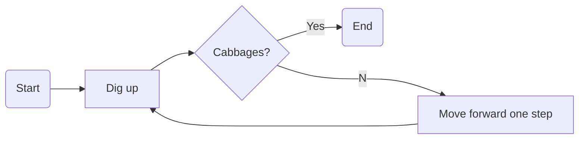

# Diagrams

Markdown doesn’t have to be flat text. Here’s how we wire live [Mermaid](https://mermaid.js.org/) and [Draw.io](https://app.diagrams.net/) diagrams straight into TeXSmith, no opaque binaries, friendly diffs.

Take this source:

````markdown
--8<--- "examples/diagrams/diagrams.md"
````

## Rendered Markdown

MkDocs render:

### Draw.io Diagram


/// caption
Euclidean algorithm for the greatest common divisor
///

### Mermaid Diagram



## PDF

And the PDF render (click to download):

````md {.snippet data-caption="Download PDF" data-frame="true" data-width="60%" data-cwd="../../examples/diagrams"}
---8<--- "examples/diagrams/diagrams.md"
````
