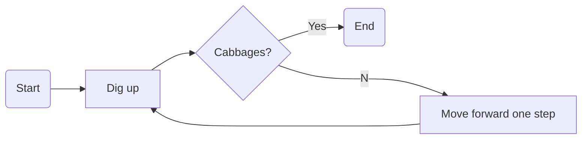

# Diagrams

Markdown doesn’t have to be flat text. Here’s how we wire live [Mermaid](https://mermaid.js.org/) and [Draw.io](https://app.diagrams.net/) diagrams straight into TeXSmith, no opaque binaries, friendly diffs.

```yaml {.snippet }
width: 60%
cwd: ../../examples/diagrams
sources:
  - diagrams.md
template: article
fragments:
  ts-frame
press:
  frame: true
```

Here the source:

````markdown
--8<--- "examples/diagrams/diagrams.md"
````

## Rendered Markdown

Obviously everything built with texsmith can also be rendered in this very Markdown file:

### Draw.io Diagram


/// caption
Euclidean algorithm for the greatest common divisor
///

### Mermaid Diagram



## Draw.io backend choice

TeXSmith now tries a Playwright-based exporter first (cached under `~/.cache/texsmith/playwright`), falling back to the local `drawio`/`mmdc` CLI and finally the Docker image. Force a specific path with `--diagrams-backend=playwright|local|docker` if needed.
