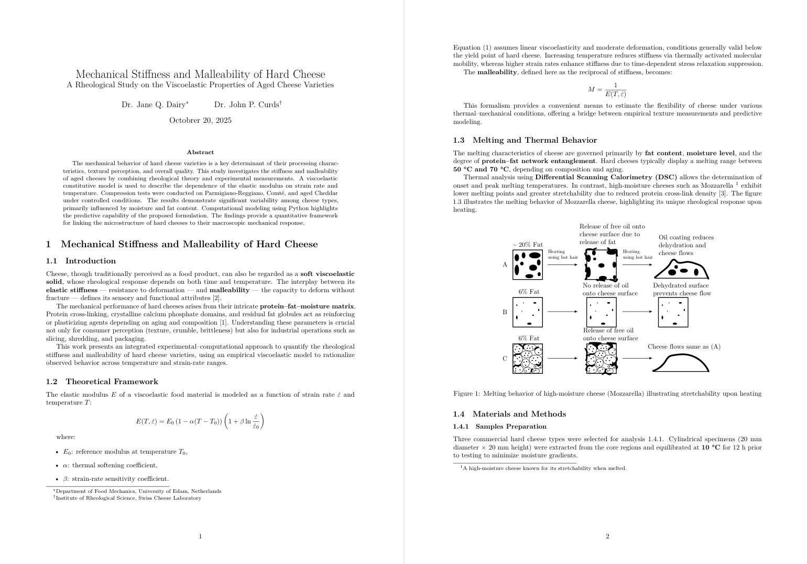

# Examples

Use these projects to verify your toolchain end-to-end. Each section lists prerequisites, the smoke-test command, and the expected artefacts. When wiring CI, reproduce the same commands (plus `--classic-output` if you prefer deterministic logs).

## Prerequisites

- Use the built-in `article` template (`-tarticle`) or point to a custom template.
- Ensure TeX Live/MacTeX/MiKTeX provides the packages required by the template (`texsmith template info article` lists them).
- For diagrams, install Docker and `minlag/mermaid-cli` or configure an alternative converter.

## Scientific Paper

The `examples/scientific-paper` folder converts `cheese.md` + `cheese.bib` into a fully typeset paper with bibliography.

### Smoke test

```bash
cd examples/scientific-paper
texsmith render cheese.md cheese.bib \
  --template article \
  --output-dir ../../build/examples/scientific-paper \
  --build \
  --classic-output
```

Expected artefacts:

- `build/examples/scientific-paper/cheese.tex`
- `build/examples/scientific-paper/cheese.pdf`
- `build/examples/scientific-paper/output/latexmk.log`



## Diagrams

`examples/diagrams` demonstrates Mermaid and Draw.io rendering.

### Smoke test

```bash
cd examples/diagrams
texsmith render diagrams.md \
  --template article \
  --output-dir ../../build/examples/diagrams \
  --build \
  --classic-output
```

Expected artefacts include rendered diagram PDFs (requires Docker) plus `diagrams.pdf`.


## Markdown Feature Showcase

`examples/markdown/features.md` exercises Markdown extensions and custom front-matter overrides.

### Smoke test

```bash
cd examples/markdown
texsmith render features.md \
  --template article \
  --output-dir ../../build/examples/markdown \
  --build \
  --classic-output
```

Use this example to catch regressions in renderer handlers, typography tweaks, and bibliography overrides.

## Automate the suite

Run `scripts/run_example_smoke_tests.sh` from the repository root to execute all
commands sequentially and collect outputs under `build/examples-smoke/`. Wire
the script into CI to keep diagrams and bibliographies green.
