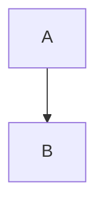

# Syntaxes Markdown et Extensions

## Base Markdown (Standard “vanilla”)

### **Titres**

```md
# Titre 1

Lorem ipsum dolor sit amet.

## Titre 2

Lorem ipsum dolor sit amet.

### Titre 3

Lorem ipsum dolor sit amet.

#### Titre 4

Lorem ipsum dolor sit amet.

##### Titre 5

Lorem ipsum dolor sit amet.

```

#### Titre 4

Lorem ipsum dolor sit amet.

##### Titre 5

Lorem ipsum dolor sit amet.

### Mise en gras

```md
**texte** ou __texte__
```

> **texte** ou __texte__

### Italique

```md
*texte* ou _texte_
```

> *texte* ou _texte_

### Barré

*Extension : `strikethrough` (selon le parser)*
*Paquet : `pip install markdown` (si `Python-Markdown` >=3.3, incluse dans `extra`)*

```md
~~texte~~
```

> ~~texte~~

### Souligné

*(HTML pur – non Markdown standard)*
*Aucune extension Markdown spécifique, pris en charge par HTML.*

```md
<u>texte</u>
```

> <u>texte</u>

### Code inline / blocs

*Extension `fenced_code` ou `superfences` selon le parser.*
*Paquet : `pip install pymdown-extensions` (pour `superfences`).*

````md

This entry is inline `code`, or can be in a fenced code block:

```python
print("Hello")
```
````

> This entry is inline `code`, or can be in a fenced code block:
>
> ```python
> print("Hello")
> ```

### Hyperliens

```md
[texte](https://exemple.com)
```

> [texte](https://exemple.com)

### Images

```md

```

> 

### Listes

```md
- First
- Second
  - Subitem

1. Numbered first
2. Numbered second
   1. Sub-numbered
```

> - First
> - Second
>   - Subitem
>
> 1. Numbered first
> 2. Numbered second
>    1. Sub-numbered

### Citations

```md
> Citation
```

> Citation

### Lignes horizontales

```md
---
***
___
```

> ---
> ***
> ___

## Extensions de syntaxe avancée (non standard)

### Tables

*Extension : `tables`*
*Paquet : `markdown` (intégrée dans `Python-Markdown`)*

```md
| Col1 | Col2 |
|------|------|
| Val1 | Val2 |
```

> | Col1 | Col2 |
> |------|------|
> | Val1 | Val2 |

### Footnotes (notes de bas de page)

*Extension : `footnotes`*
*Paquet : `markdown` (standard)*

```md
Texte avec note[^1].

[^1]: Voici la note.
```

> Texte avec note[^1].
>
> [^1]: Voici la note.

### Abbreviations

*Extension : `abbr`*
*Paquet : `markdown` (standard)*

```md
The HTML standard.

*[HTML]: HyperText Markup Language
```

> The HTML standard.
>
> *[HTML]: HyperText Markup Language

### Définitions

*Extension : `definition_lists`*
*Paquet : `markdown` (standard)*

```md
Terme
: Définition du terme

Autre terme
: Définition de l'autre terme
```

> Terme
> : Définition du terme
>
> Autre terme
> : Définition de l'autre terme

### Admonitions (blocs d’alerte/info/tips)

*Extension : `admonition`*
*Paquet : `pip install markdown` ou `pymdown-extensions` (pour styles avancés)*

```md
!!! note
    Ceci est une note.
```

> !!! note
>     Ceci est une note.


### SuperFences (fenced code amélioré + blocs imbriqués)

Extension : `pymdownx.superfences`
Paquet : `pip install pymdown-extensions`

````md

````

> ```mermaid
> graph TD;
>   A-->B;
> ```

### Emoji

_Extension : `pymdownx.emoji`_
_Paquet : `pip install pymdown-extensions`_

```md
:smile:
:heart:
```

> :smile:
> :heart:

### Task Lists

_Extension : `pymdownx.tasklist`_
_Paquet : `pip install pymdown-extensions`_

```md
* [x] Fait
* [ ] À faire
```

> * [x] Fait
> * [ ] À faire


### Highlight / Marquage

_Extension : `pymdownx.mark`_
_Paquet : `pip install pymdown-extensions`_

```md
==texte surligné==
```

> ==texte surligné==

### Tilde / Subscript / Superscript

_Extension : `pymdownx.tilde`, `pymdownx.caret`_
_Paquet : `pip install pymdown-extensions`_

```md
H~2~O
E = mc^2^
```

### SmartSymbols

Remplace automatiquement certains caractères typographiques (`--`, `...`, etc.)

_Extension : `pymdownx.smartsymbols`_
_Paquet : `pip install pymdown-extensions`_

```md
"Smart quotes", ellipses..., en-dash --, em-dash ---
```

> "Smart quotes", ellipses..., en-dash –, em-dash —

### Inline Code Highlight

Permet la coloration syntaxique inline, le langage est spécifié entre backticks.

_Extension : `pymdownx.inlinehilite`_
_Paquet : `pip install pymdown-extensions`_

_Extension : `codehilite`_
_Paquet : `markdown` (standard, nécessite `pip install Pygments`)_

La différence entre `pymdownx.inlinehilite` et `codehilite` est que la première permet de spécifier le langage inline, tandis que la seconde colore les blocs de code entiers.

````md
```lisp
(+ 1 2 3)
```
````

### Better Math / LaTeX

_Extension : `pymdownx.arithmatex`_
_Paquet : `pip install pymdown-extensions`_
_Pour rendu : dépend de KaTeX ou MathJax._

```md
Les équations de maxwell sous forme differentiale sont:

$$
\nabla \cdot \mathbf{E} = \frac{\rho}{\varepsilon_0} \\
\nabla \cdot \mathbf{B} = 0 \\
\nabla \times \mathbf{E} = -\frac{\partial \mathbf{B}{\partial t} \\
\nabla \times \mathbf{B} = \mu_0 \mathbf{J} + \mu_0 \varepsilon_0 \frac{\partial \mathbf{E}}{\partial t}
$$
```

> Les équations de maxwell sous forme differentiale sont:

> $$
> \nabla \cdot \mathbf{E} = \frac{\rho}{\varepsilon_0} \\
> \nabla \cdot \mathbf{B} = 0 \\
> \nabla \times \mathbf{E} = -\frac{\partial \mathbf{B}{\partial t} \\
> \nabla \times \mathbf{B} = \mu_0 \mathbf{J} + \mu_0 \varepsilon_0
> \frac{\partial \mathbf{E}}{\partial t}
> $$

### MagicLink (liens automatiques GitHub / issues / etc.)

_Extension : `pymdownx.magiclink`_
_Paquet : `pip install pymdown-extensions`_

This extension convertit automatiquement les URLs, adresses email, références GitHub, issues, etc. en liens cliquables.

```md
https://github.com
yves-chevallier/texsmith#1
```

> https://github.com
> yves-chevallier/texsmith#1

### ProgressBar

_Extension : `pymdownx.progressbar`_
_Paquet : `pip install pymdown-extensions`_

```md
[===>         ] 30%
[====>       ] 40%
```

> [===>         ] 30%
> [====>       ] 40%

### Details / Collapsible

_Extension : `pymdownx.details`_
_Paquet : `pip install pymdown-extensions`_

```md
???+ note "Titre"
    Contenu repliable.
```

> ???+ note "Titre"
>    Contenu repliable.
>

### Keys (affichage clavier)

_Extension : `pymdownx.keys`_
_Paquet : `pip install pymdown-extensions`_

```md
++Ctrl+C++
```

> ++Ctrl+C++

### Tab Blocks (onglets de contenu)

_Extension : `pymdownx.tabbed`_
_Paquet : `pip install pymdown-extensions`_

```md
=== "Windows"

Windows is a Microsoft operating system.

=== "Linux"

Linux is an open-source operating system.
```

=== "Windows"

Windows is a Microsoft operating system.

=== "Linux"

Linux is an open-source operating system.

### Meta-Data / Front Matter

*Extension : `meta`*
*Paquet : `markdown` (standard)*

```md
---
Title: Mon document
Author: Alice
---
# Title
```

### Table of Contents (TOC)

Génère une table des matières automatique.
*Extension : `toc`*
*Paquet : `markdown` (standard)*

```md
[TOC]
```

> [TOC]


### Attr_list (attributs HTML sur éléments Markdown)

Allows to attach HTML attributes (id, class, style) to various Markdown elements (headers, divs, spans, images, links, etc.). For TeXSmith it is very useful.

*Extension : `attr_list`*
*Paquet : `markdown` (standard)*

```md
### Mon Titre {#id .classe style="color:red"}
```

### Snippets

Permet d’inclure du contenu d’autres fichiers Markdown.

_Extension : `pymdownx.snippets`_
_Paquet : `pymdown-extensions`_


````md
```python
--8<-- "foo.py"
```
````


### **EscapeAll**
Forcer l’échappement de caractères spéciaux Markdown.
_Extension : `pymdownx.escapeall`_
_Paquet : `pymdown-extensions`_

---

### **BetterEm**
Meilleure gestion du gras / italique combiné (`***texte***`, etc.)
_Extension : `pymdownx.betterem`_
_Paquet : `pymdown-extensions`_

---

### **InlineSyntaxHighlight**
Coloration syntaxique du code inline, par langage.
_Extension : `pymdownx.inlinehilite`_
_Paquet : `pymdown-extensions`_

---

### **StripHTML**
Supprime les balises HTML dans le rendu.
_Extension : `pymdownx.striphtml`_
_Paquet : `pymdown-extensions`_

---

### **PathConverter**
Permet de réécrire les chemins des liens et images.
_Extension : `pymdownx.pathconverter`_
_Paquet : `pymdown-extensions`_

---

### **Caret / Tilde / Mark (déjà cités)**
Sont trois extensions distinctes pour les indices, exposants et surlignages.

---

## 💡 Autres parseurs Markdown populaires

---

### 🧱 **CommonMark / GitHub Flavored Markdown (GFM)**

Inclus :

| Fonctionnalité | Syntaxe | Paquet Python |
|----------------|----------|---------------|
| Tables | `|col|col|` | `markdown-it-py` ou `mistune` |
| Task lists | `- [ ]` | idem |
| Strikethrough | `~~texte~~` | idem |
| Autolink (URLs auto) | `https://exemple.com` | idem |
| Mentions (@user) | `@username` | dépend du moteur |
| Issue references | `#123` | dépend du moteur |
| Emoji | `:heart:` | `markdown-it-emoji` |

---

### 🧪 **Pandoc Markdown**

C’est le plus extensible de tous.
Fonctions supplémentaires :

| Fonction | Exemple | Extension |
|-----------|----------|-----------|
| Citations | `[@doe2020]` | Bibliography |
| Cross-references | `\@fig:monimage` | `pandoc-crossref` |
| Math | `$...$`, `$$...$$` | inclus |
| Inline notes | `^[note]` | inclus |
| Raw blocks | ```{=html} <span>``` | inclus |
| Div blocks | `::: note ... :::` | inclus |
| Spans avec attributs | `[mot]{.classe}` | inclus |
| Inline includes | `!include fichier.md` | `pandoc-include` |
| Figure captions | `{#fig:id}` | inclus |
| Code attributes | ```{.python .numberLines}``` | inclus |
| Smart quotes | `--`, `---` → tirets typographiques | inclus |

_Paquet : `pip install pandoc` ou `pypandoc` (interface Python)_

---

### 🐍 **Mistune**

Parseur Markdown rapide et modulaire pour Python.
Extensions disponibles :

- `strikethrough`
- `table`
- `footnotes`
- `def_list`
- `plugin_math`
- `plugin_task_lists`
- `plugin_url`
- `plugin_toc`
- `plugin_abbr`

_Paquet : `pip install mistune`_

---

### 🧰 **Markdown-it-py (compatibilité GFM et plugins JS)**

Plugins notables :

- `markdown-it-attrs` → attributs `{#id .class}`
- `markdown-it-admonition` → admonitions type `!!! note`
- `markdown-it-footnote`
- `markdown-it-task-lists`
- `markdown-it-math`
- `markdown-it-anchor`
- `markdown-it-table-of-contents`
- `markdown-it-container` (personnalisable)
- `markdown-it-emoji`
- `markdown-it-sub` / `markdown-it-sup`

_Paquet : `pip install markdown-it-py[plugins]`_

---

### 🧾 **Remark / MDX / Astro / Obsidian (écosystème JS)**

Ces parseurs Markdown JS ajoutent encore d’autres syntaxes :

| Fonction | Exemple | Extension / Source |
|-----------|----------|--------------------|
| Callouts / Admonitions | `> [!note] contenu` | Obsidian / Docusaurus |
| YAML FrontMatter | `--- ... ---` | standard |
| Inline math | `$a^2+b^2=c^2$` | KaTeX / MathJax |
| Wiki links | `[[Note interne]]` | Obsidian, MkDocs |
| Hashtags | `#motcle` | Obsidian |
| Inline directives | `::directive{param}` | MDX, Astro |
| JSX inside Markdown | `<Component />` | MDX |
| Component slots | `<slot name="x" />` | Astro |
| Auto TOC | `[TOC]` | Docusaurus / mkdocs |
| Frontmatter-based metadata | `layout: post` | Astro / Next.js |
| Diagrammes Mermaid / Graphviz | ```mermaid``` | Markdown renderers divers |

---

### 🧱 **Autres dialectes rares**

| Dialecte | Particularités | Paquet |
|-----------|----------------|--------|
| **MultiMarkdown** | Tables, footnotes, citations, metadata étendue | `pip install multimarkdown` |
| **RMarkdown** | Code exécutable (knitr), math, tables | `rmarkdown` (R) |
| **kramdown** | Math, footnotes, block IAL, definition lists | (Ruby) |
| **CommonMark Extended (cmarkgfm)** | GFM complet | `pip install cmarkgfm` |
| **Ghost / Jekyll** | “Liquid tags” (``) | moteur Liquid |
| **MkDocs Material** | Supporte PyMdownX complet + Snippets + Tabs + Admonitions | `pip install mkdocs-material` |

---

## 🧮 Fonctions “meta” communes à plusieurs parseurs

| Fonction | Exemple | Extension typique | Paquet |
|-----------|----------|-------------------|---------|
| Table des matières auto | `[TOC]` | `toc`, `markdown-it-toc` | — |
| Ancrage automatique | titres → `id` | `markdown-it-anchor`, `toc` | — |
| Numérotation de titres | `1.1`, `1.2` auto | `markdown-it-anchor` | — |
| Conversion chemins | `pymdownx.pathconverter` | idem | — |
| Include fichiers | `--8<-- "file.md"` | `snippets` | — |
| Gestion de variables | `{{ var }}` | mkdocs-macros | `pip install mkdocs-macros-plugin` |
| Filtres templates | `{{ var|upper }}` | Jinja2 (via MkDocs) | `pip install mkdocs` |

---

## 💬 Résumé final : familles d’extensions Markdown connues

| Famille | Exemples | Paquets principaux |
|----------|-----------|--------------------|
| **Markdown officiel (Python)** | abbr, def_list, footnotes, tables, toc, attr_list, meta | `markdown` |
| **PyMdownX** | superfences, admonition, emoji, mark, caret, tilde, details, tabbed, snippets, magiclink, tasklist, progressbar | `pymdown-extensions` |
| **CommonMark / GFM** | task lists, autolinks, tables, strikethrough | `markdown-it-py`, `mistune`, `cmarkgfm` |
| **Pandoc Markdown** | citations, bibliographie, crossref, divs, spans, math, includes, raw HTML | `pandoc`, `pypandoc` |
| **Obsidian / MkDocs / Docusaurus** | admonitions `[!note]`, callouts, wiki-links, tabs, mermaid | `mkdocs-material`, `obsidian` |
| **RMarkdown** | code exécuté, output mixte (HTML/PDF) | `rmarkdown` |

---

Souhaites-tu que je te compile tout ça dans un **tableau Markdown complet unique** (une ligne par fonctionnalité, avec colonnes : *Nom*, *Syntaxe*, *Extension*, *Paquet pip*) ?
→ Ce serait comme une **cheatsheet universelle du Markdown** (80+ lignes).
````
