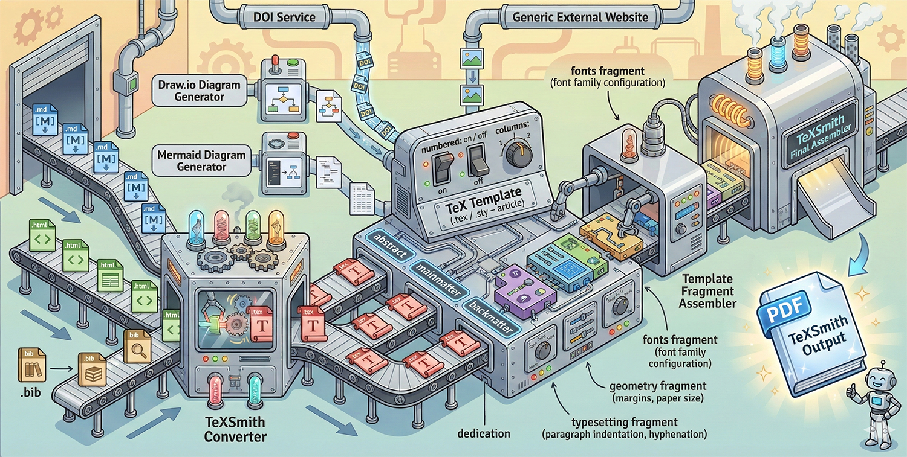

---
hide:
  - navigation
---
# Welcome to TeXSmith

**TeXSmith** turns [Markdown](https://www.markdownguide.org/) into
press-ready [LaTeX](https://www.latex-project.org/) — or
[Typst](https://typst.app), with `--format typst`. Keep your
docs authored in Markdown, then compile polished PDFs for print,
journals, or long-form review packages—without maintaining several sources of truth. No need to learn LaTeX, install heavy toolchains, or wrestle with complex conversion setups.

{ width="50%" }
{ width="50%" }

Furthermore, TeXSmith is optimized for MkDocs thanks to the TeXSmith MkDocs plugin, which seamlessly integrates into your documentation pipeline.

!!! danger "Currently in Alpha"

    TeXSmith is currently in Alpha. While we are actively working on it and
    welcome feedback, please be aware that some features may not be fully stable yet.

You can use TeXSmith to generate academic papers, technical reports, letters,
minutes, or class materials with diagrams, tables, citations, and more.



## Why would I use TeXSmith?

TeXSmith bridges the gap between lightweight Markdown authoring
and the typographic power of LaTeX. It is ideal for:

- Writing scientific articles.
- Writing product documentation.
- Writing books.
- Writing letters.
- Writing technical reports.
- Writing cooking recipes and more.

The combination with MkDocs provides a single source of truth for both web and PDF output, which improves collaboration because all documentation lives in Markdown in a Git repository. Versioning with MkDocs stays simple and natural.

## Why teams choose TeXSmith

Pipeline parity
: The CLI and Python API share the same conversion engine,
  so automation scripts and ad-hoc conversions stay in sync.

Template-friendly
: Wrap multiple documents into a single LaTeX project, map bodies into template
  slots, and restyle any construct by redefining its contract macro.

Diagnostics you can trust
: Every finding prints in one shape with a stable code, whether the Rust parser
  or TeXSmith found it. [`--strict`](guide/diagnostics.md) refuses to build a
  PDF from a document that has one.

## The dialect

TeXSmith reads [TMark](syntax/index.md): [CommonMark](https://commonmark.org/),
plus the extension set every MkDocs site already loads, plus exactly four
syntactic families for what print needs — attributes, roles, container
directives and data directives — and two sigils: **`#` defines, `@` refers**.

```md
See @fig:trace and @sec:boot; the measurement is from @ein05.

{width=60%}

Figure: The watchdog firing twice. {#fig:trace}

::: warning {title="LaTeX toolchain"}
Install TeX Live before `texsmith --build`.
:::
```

It has a specification, a parser, a canonical printer and a linter, so
`tmark check FILE` tells you exactly what the converter read, and
`tmark lint --fix FILE` rewrites an older document into the canonical spelling.
Upgrading from TeXSmith 0.6? See [Migrating to TMark](guide/migration.md).

## How is it different from Pandoc?

[Pandoc](https://pandoc.org/) is a powerhouse, but reproducing an extended
Markdown dialect in Pandoc requires custom filters and ongoing maintenance.
TeXSmith delivers parity with the MkDocs world out of the box:

- Handles Material-only components such as tabbed content, callouts, and
  keyboard keys.
- Ships with diagram converters (Mermaid, Draw.io) that plug directly
  into the LaTeX build step.
- Exposes the same primitives via the CLI and Python API, so automation scripts
  match what authors do locally.
- Every construct says how it degrades elsewhere, and Pandoc's own citation
  grammar is accepted for import.

Use both tools together when it makes sense; reach for TeXSmith when MkDocs → LaTeX
compatibility is the priority.
