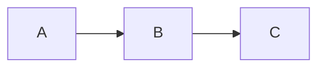

# Mermaid Diagrams

À l'instar de MkDocs, TeXSmith can render [Mermaid](https://mermaid.js.org) diagrams. However, as with MkDocs diagrams are live-rendered into the browser, for PDF production, 
TeXSmith converts them to vector PDFs during the conversion pipeline. This would require either

1. Installing `mermaid-cli` and its dependencies in your environment, or
2. Using Docker with the pulled image `mermaidjs/mermaid-cli`.

## Inline diagram

````markdown

````


## External diagrams

Sometime diagrams are better maintained in separate files. TeXSmith supports two ways to include them.

1. Reference external `.mmd` / `.mermaid` files.
2. Embed Mermaid Live snippets using `pako:` URLs for live editing.

Thanks to the `texsmith.mermaid` extension, you can include external Mermaid diagrams in your documents.
The extension will convert them into standard mermaid diagrams during the Markdown processing stage.
It is thus transparent to the pipeline whether the diagram is inline or external.
  
Using a `mmd` file is as simple as including an image:

```markdown

```


Pako is a compression library that Mermaid Live uses to encode diagrams in URLs for sharing and embedding such as:

```markdown

```

On rendering in HTML or PDF, TeXSmith will add an hyperlink to the Mermaid Live editor. Try clicking the image below:


## LaTeX Rendering

Here an example of how diagrams are rendered in LaTeX with TeXSmith:

[](../assets/examples/mermaid.pdf)

## Conversion by TeXSmith

All Mermaid diagrams are converted to PDF and included with `\includegraphics`
so they integrate cleanly with templates and LaTeX floats.

On printed documents you may want to adjust the style of the diagrams to
better suit the medium. You can provide a custom configuration file by setting
the `mermaid_config` attribute either in front matter or via the CLI:

```yaml
---
press:
  mermaid_config: mermaid-config.json
---
```

Alternatively, you can add a `mermaid-config.json` file to the `~/.texsmith/` directory
to apply it globally to all your TeXSmith projects.

