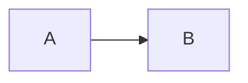

# Mermaid

TeXSmith prend en charge les diagrammes Mermaid lors de la conversion vers LaTeX. Suivez les sections ci-dessous pour choisir la forme la plus adaptée à votre contenu.

## Blocs de code

```markdown

```

Le commentaire de première ligne (`%% …`) reste optionnel mais, lorsqu'il est présent, il devient la légende du diagramme dans le document LaTeX généré.

## Fichiers locaux `.mmd` / `.mermaid`

Vous pouvez stocker le diagramme dans un fichier séparé et l'inclure comme une image :

```markdown

```

- Les extensions `.mmd` et `.mermaid` sont prises en charge.
- L'attribut `alt` (ou le texte entre crochets) sert de légende si le fichier ne fournit pas déjà un commentaire `%% …`.
- Les chemins sont résolus par rapport au document courant, puis à la racine du projet MkDocs.

## Liens Mermaid Live (`pako:`)

Les exports Mermaid Live compressés sont également interprétés :

```markdown

```

La charge utile `pako:` est automatiquement décodée ; vous n'avez rien à télécharger manuellement. Utilisez l'attribut `alt` pour fournir une légende.

## Remarques

- Les diagrammes Mermaid sont rendus en PDF puis inclus via `\includegraphics`, ce qui leur permet de s'intégrer aux templates de figure.
- Les artefacts produits sont mis en cache à l'aide d'une clé basée sur le contenu du diagramme afin d'éviter des conversions répétées inutiles.
