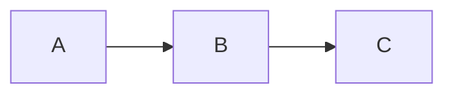

# Mermaid Diagrams

Just like MkDocs, TeXSmith understands [Mermaid](https://mermaid.js.org) diagrams. Browsers render them on the fly, but PDFs need static assets, so TeXSmith converts each diagram into a vector PDF during the build. That requires either:

1. Installing `mermaid-cli` and its dependencies in your environment, or
2. Using Docker with the pulled image `mermaidjs/mermaid-cli`.

## Inline diagram

````markdown

````


## External diagrams

Sometimes diagrams live better outside the Markdown. TeXSmith supports:

1. Reference external `.mmd` / `.mermaid` files.
2. Embed Mermaid Live snippets using `pako:` URLs for live editing.

The `texsmith.mermaid` extension sniffs out these references, pulls the content in, and treats inline/external sources the same way.

Using a `mmd` file is as simple as including an image:

```markdown

```


Mermaid Live encodes diagrams via Pako (a compression library) so you can share/edit them through URLs:

```markdown

```

When TeXSmith renders HTML/PDF it wraps the image with a link to the Mermaid Live editor. Click the preview to inspect the source:


## LaTeX Rendering

Here’s how the diagrams look once TeXSmith embeds them:

````md { .snippet }
---8<--- "examples/mermaid/mermaid.md"
````

## Conversion by TeXSmith

All Mermaid diagrams are converted to PDF and included with `\includegraphics`
so they integrate cleanly with templates and LaTeX floats.

Printed output might deserve a different theme. Point `mermaid_config` to a JSON config (front matter or CLI `--attribute press.mermaid_config=...`) to override:

```yaml
---
press:
  mermaid_config: mermaid-config.json
---
```

Alternatively, you can add a `mermaid-config.json` file to the `~/.texsmith/` directory
to apply it globally to all your TeXSmith projects.
