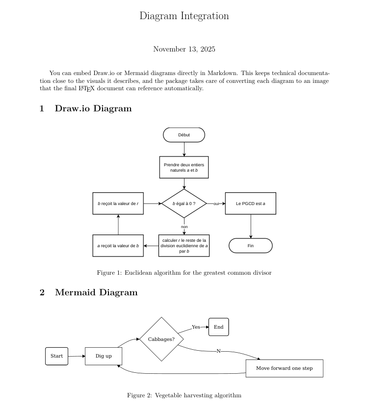

# Notes on TeXSmith Extensions

TeXSmith ships with laser-focused extensions to close the LaTeX-sized gaps that stock Markdown leaves behind. They cooperate with MkDocs and MkDocs Material, tagging the HTML with enough metadata for the LaTeX renderer to finish the heavy lifting.

- Index entries double as Lunr tags in MkDocs and page references in LaTeX.
- Glossary entries and acronyms keep terminology consistent.
- Citations and cross-references wire figures, tables, equations, and bibliography entries together.
- Raw LaTeX fences and inline snippets let you sprinkle precise TeX without polluting the HTML build.

## Syntax

The syntax for these helpers follows a few rules:

1. Easy to type in Markdown.
2. Friendly with standard Markdown parsers.
3. Collision-free with existing extensions.
4. Minimal visual noise in the raw text.

### Syntax shorthand

`@[]` Smart references
: Expands to the proper label for the referenced object. Figures become `Figure X`, tables render as `Table Y`, sections as `Section Z`, equations as `(N)`, theorems as `Theorem M`, and so on.

`^[]` Footnotes / bibliographic citations
: Resolves to either an inline footnote (if defined locally) or a bibliography citation.

`{index}[...]` Index entries
: Inserts one or more index terms. They stay invisible in HTML yet show up as tags in Lunr and as `\index{}` entries in LaTeX.

Quick reference:

- `[](:)` Add content block
- `@()` Cross-reference helper
- `^[]` / `\cite{}` Bibliographic citation
- `{index}[term]` / `\index{}` Index entry

## Other extensions

- Epigraphs: define `epigraph` blocks in front matter or mark blockquotes with the `epigraph` class to route them through the LaTeX epigraph macro.
- Drop caps: Material’s `lettering` syntax (`:[A](Natoly)`) produces LaTeX letterine output automatically.
- Wikipedia shortcodes keep working; they simply render as annotated links in both HTML and LaTeX.

## Index

Printed indexes convey intent with typography:

- Normal text: the topic is discussed.
- Italic: quick mention only.
- Bold: this section focuses on the topic.
- Bold italic: primary topic plus ancillary references.
- Nested entries: group related terms.

Use `{index}` plus multiple `[brackets]` to build entries. Append `{b}`, `{i}`, or `{bi}` to tweak the style, and specify `{index:registry}` when you want to file the entry under a custom registry (handy for multi-index books).

```md
Do you know the Gulliver's Travels story about the egg dispute?
{index}[endianness]{i}

{index}[endianness]{bi}
{index}[endianness]{b}
{index}[byte order][endianness]{i}
{index:physics}[relativity]{b}
```

## Citations

Bibliographic references land in two ways:

1. Point TeXSmith at one or more `.bib` files and cite entries using `^[]`.
2. Declare references directly in front matter via DOIs or inline metadata.

```yaml
---
bibliography:
  # Just DOI entry, TeXSmith will fetch the rest
  ein05: https://doi.org/10.1002/andp.19053221004
  # Manual entry
  KOFINAS2025:
    type: article
    title: |
        The impact of generative AI on academic integrity of authentic
        assessments within a higher education context
    authors:
      - name: "Alexander K. Kofinas"
        affiliation: "University of Example"
      - "Crystal Han-Huei Tsay"
      - "David Pike"
    journal: "British Journal of Educational Technology"
    date: 2025-03
    volume: 56
    number: 6
    pages: "2522-2549"
    url: https://doi.org/10.1111/bjet.13585
---
We know that time is relative ^[ein05] and recent work explores
assessment ^[KOFINAS2025]. You can also cite multiple
references ^[ein05,KOFINAS2025].
```

Or with the CLI:

```sh
texsmith article.md article.bib
```

Or directly in Python:

```python
from pathlib import Path

from texsmith.api.service import ConversionRequest, ConversionService

service = ConversionService()
request = ConversionRequest(
    documents=[Path("article.md")],
    bibliography_files=[Path("article.bib")]
)
response = service.execute(request)
tex_path = response.render_result.main_tex_path
print(f"LaTeX written to: {tex_path}")
```

## Math

Inline math uses the standard Markdown-friendly delimiters: `$...$` or `\(...\)` for inline spans, `$$...$$` or `\[...\]` for display mode. Most Markdown engines (including MkDocs) pass these through untouched.

Numbered equations are not part of Markdown itself, so TeXSmith handles the heavy lifting for you.

```md
{#pythagoras}
: $$a^2 + b^2 = c^2$$

From @[pythagoras], we know that...
```

The equation receives an automatic number and can be referenced inline.

## Theorems

Use admonitions to define theorems, lemmas, definitions, and friends.

```md
!!! theorem "Pythagorean Theorem" {#thm:pythagoras}
    This is a theorem about right triangles and can be summarized in the next
    equation
    $$ x^2 + y^2 = z^2 $$
```

It will be rendered as:

```latex
\begin{theorem}[Pythagorean theorem]
\label{pythagorean}
This is a theorem about right triangles and can be summarized in the next
equation
\[ x^2 + y^2 = z^2 \]
\end{theorem}
```

TeXSmith automatically generates the following admonition types:

- Theorem (📐)
- Corollary (🧾)
- Lemma (📜)
- Proof (🔍)

## Glossary

Specific terms live in the glossary; shorthand belongs in the acronym list. Keep them separate so TeXSmith can decide when to expand, hyperlink, or index each one.

Glossary entries
: Definitions for full terms, whether single words or multi-word concepts.

Acronyms
: Shortened forms such as NASA or UNESCO, often with an expanded description.

Define both collections in front matter:

```yaml
acronyms:
  nasa:
    name: NASA
    description: National Aeronautics and Space Administration
  unesco:
    name: UNESCO
    description: United Nations Educational, Scientific and Cultural Organization
glossary:
  solid:
    name: S.O.L.I.D.
    description: |
        Acronym for five design principles intended to make software designs
        more understandable, flexible, and maintainable.

        1. Single Responsibility Principle
        2. Open/Closed Principle
        3. Liskov Substitution Principle
        4. Interface Segregation Principle
        5. Dependency Inversion Principle
  liskov:
    name: Liskov Substitution Principle
    description: |
        The Liskov Substitution Principle (LSP) states that objects of a
        superclass should be replaceable with objects of a subclass without
        affecting the correctness of the program. In other words, if S is a
        subtype of T, then objects of type T in a program may be replaced with
        objects of type S without altering any of the desirable properties of
        that program (e.g., correctness).
```

Inside the Markdown document you can reference glossary entries with the `gls:` prefix:

```md
From the well-known [](gls:solid) principles, the following class must
be [](gls:liskov) Substitution Principle compliant.
```

### Wikipedia

Many glossary-worthy entries live on Wikipedia, and TeXSmith can pull their summaries automatically.

```md
From the well known [SOLID](https://en.wikipedia.org/wiki/SOLID)
```

When enabled, TeXSmith converts Wikipedia links into glossary entries for the printed document.

```toml
[texsmith.extensions]
wikipedia_glossary = true
```

## Caption

TeXSmith style
:   Here is a figure with a caption:

    ```md
    A diagram with 25% width
    : {width=25%}

    Table Caption Avec une grosse famille de chats  {#bigcats}
    : | Cat Name    | Age | Color      |
      | ----------- | ---:| ---------- |
      | Whiskers    |  2  | Tabby      |
      | Mittens     |  5  | Black      |
    ```

Pymarkdown style
:   Here is a figure with a caption:

    ```md
    {width=25%}

    /// figure-caption
        attrs: {#foobar}
        Avec un chocolat violet qui sent la **vanille**
    ///
    ```

## Formatting

Plain Markdown covers **bold**, *italic*, and `inline code`. PyMdown extensions add ~~strikethrough~~, ==highlighted text==, ^^inserted text^^.

Small capitals are missing from the spec, so TeXSmith repurposes the double-underscore syntax for that effect:

```markdown
__Small Capitals__
```

which renders as:

```latex
\textsc{Small Capitals}
```

## Tables

One of the limitations of Markdown is the lack of support for complex table features such as multi-row and multi-column cells, cell alignment, and captions.

When a table is too large to fit on the page, try:

- Slightly resizing the table to fit the available width.
- Allowing cells to wrap across multiple lines.
- Rotating the table to landscape orientation.
