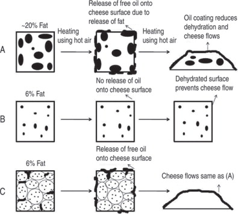

---
meta:
  title: >
    Mechanical Stiffness and Malleability of Hard Cheese
  subtitle: >
    A Rheological Study on the Viscoelastic Properties of Aged Cheese Varieties
  authors:
    - name: Dr. Jane Q. Dairy
      affiliation: Department of Food Mechanics, University of Edam, Netherlands
    - name: Dr. John P. Curds
      affiliation: Institute of Rheological Science, Swiss Cheese Laboratory
  date: Octobrer 20, 2025
---
## Abstract

The mechanical behavior of hard cheese varieties is a critical factor determining their processing, texture, and consumer perception. This paper explores the stiffness and malleability of hard cheese through theoretical modeling and empirical measurement. Using a viscoelastic model, we establish a relationship between strain rate, temperature, and cheese deformation. Experimental results demonstrate significant differences between Parmigiano-Reggiano [^1], Comté [^2], and aged Cheddar samples. Python-based data analysis is presented to illustrate the computational approach.

## Introduction

Cheese is not only a culinary product but also a **viscoelastic material** with complex rheological properties. The *stiffness* [^Prentice1993] (resistance to deformation) and *malleability* (ability to deform without fracture) of hard cheeses are governed by microstructural factors such as protein cross-linking, fat distribution, and moisture content [^Jaoac2019].

Understanding these properties is essential for optimizing slicing, grating, and processing methods in the food industry. This work integrates experimental data with analytical modeling to quantify the mechanical response of cheese samples under stress.

## Theoretical Framework

The **elastic modulus** $E$ of a viscoelastic food material can be expressed as a function of strain rate $\dot{\varepsilon}$ and temperature $T$:

$$
E(T, \dot{\varepsilon}) = E_0 \left( 1 - \alpha (T - T_0) \right)
\left( 1 + \beta \ln \frac{\dot{\varepsilon}}{\dot{\varepsilon}_0} \right)
$$

where:

- $E_0$: reference modulus at temperature $T_0$,
- $\alpha$: thermal softening coefficient,
- $\beta$: strain-rate sensitivity coefficient.

The **malleability** $M$ is inversely proportional to stiffness:

$$
M = \frac{1}{E(T, \dot{\varepsilon})}
$$

This simple formulation allows us to approximate the cheese’s flexibility under various thermal and mechanical conditions.

## Melting Behavior

The melting point of cheese is influenced by its fat content and moisture level. Hard cheeses typically exhibit a melting range between **50 °C and 70 °C**, depending on their composition. The melting behavior can be characterized using differential scanning calorimetry (DSC) to determine the onset and peak melting temperatures. The Mozzarella cheese, for instance, has a lower melting point due to its higher moisture content compared to aged hard cheeses like Parmigiano-Reggiano [^WADHWANI20111713].

{ width=50% }

## Materials and Methods

### Samples

Three cheese types were analyzed:

| Cheese Type         | Age (months) | Moisture Content (%) | Fat Content (%) |
|---------------------|--------------|----------------------|-----------------|
| Parmigiano-Reggiano | 24           | 29                   | 31              |
| Comté               | 18           | 33                   | 30              |
| Cheddar             | 12           | 36                   | 32              |

Cylindrical samples of 20 mm diameter were cut and conditioned at **10 °C** before testing.

### Mechanical Testing

Compression tests were performed using a TA-XT2 texture analyzer at three strain rates (0.1 s⁻¹, 1 s⁻¹, 10 s⁻¹). The **elastic modulus** was determined from the slope of the stress–strain curve in the linear deformation region.

| Cheese Type         | Strain Rate (s⁻¹) | Temperature (°C) | Elastic Modulus E (MPa) |
|---------------------|------------------:|------------------:|------------------------:|
| Parmigiano-Reggiano | 0.1              | 10               | 52.1                   |
| Parmigiano-Reggiano | 10               | 10               | 66.8                   |
| Comté               | 0.1              | 10               | 44.2                   |
| Cheddar             | 0.1              | 10               | 38.7                   |

## Computational Modeling

To evaluate the stiffness–temperature dependence numerically, a simple **Python** script was written to calculate $E(T, \dot{\varepsilon})$ from Equation (1).

```python
import numpy as np
import matplotlib.pyplot as plt

# Constants
E0 = 50.0      # Reference modulus (MPa)
T0 = 10.0      # Reference temperature (°C)
alpha = 0.02   # Thermal softening coefficient
beta = 0.15    # Strain-rate sensitivity
eps_dot0 = 1.0 # Reference strain rate

def modulus(T, eps_dot):
    """Return elastic modulus as function of T and strain rate."""
    return E0 * (1 - alpha * (T - T0)) * (1 + beta * np.log(eps_dot / eps_dot0))

# Compute modulus for a temperature range
T = np.linspace(5, 25, 100)
rates = [0.1, 1, 10]

plt.figure(figsize=(6,4))
for r in rates:
    plt.plot(T, modulus(T, r), label=f"ε̇ = {r} s⁻¹")
plt.xlabel("Temperature (°C)")
plt.ylabel("Elastic Modulus E (MPa)")
plt.title("Temperature Dependence of Cheese Stiffness")
plt.legend()
plt.grid(True)
plt.tight_layout()
plt.show()
```

[^1]: A kind of hard, granular cheese originating from Italy, known for its rich flavor and crystalline texture.

[^2]: A French cheese with a firm texture and nutty taste, often aged for extended periods.
