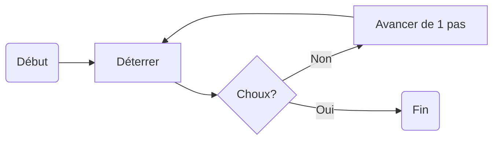

# Diagrams Integration

We can include diagrams made with Draw.io or Mermaid directly in our Markdown files. This is particularly useful for technical documentation that requires visual representations. The package will automatically convert these diagrams into images that can be embedded in the final LaTeX document easily:

## Draw.io Diagram

/// figure-caption
Euclidean Algorithm for GCD
///

## Mermaid Diagram

