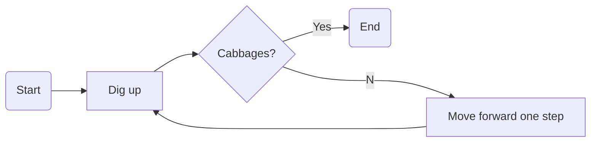

# Diagram Integration

You can embed Draw.io or Mermaid diagrams directly in Markdown. This keeps
technical documentation close to the visuals it describes, and the package
takes care of converting each diagram to an image that the final LaTeX
document can reference automatically.

## Draw.io Diagram

/// caption
Euclidean algorithm for the greatest common divisor
///

## Mermaid Diagram

