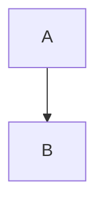

---
press:
  author: Yves Chevallier
  description: "Comprehensive overview of Markdown syntaxes and extensions."
  keywords: ["Markdown", "syntax", "extensions", "features", "cheatsheet"]
  slots:
    abstract: Abstract
  override:
    preamble: |
        \usepackage{xcolor}
        \renewenvironment{displayquote}
        {%
            \begin{tcolorbox}[
            enhanced, breakable, colback=gray!10,
            boxrule=0pt,
            borderline west={3pt}{0pt}{gray!70},
            left=6pt, right=6pt, top=6pt, bottom=6pt]%
        }
        { \end{tcolorbox} }
---
# TeXSmith Markdown Syntax

## Abstract

This document provides a comprehensive overview of Markdown syntax features and extensions supported by TeXSmith. It serves as a reference guide for users looking to leverage Markdown's capabilities in their documents. This is meant to be a cheatsheet of supported features and a test suite for custom templates.

## Core Markdown (Standard "Vanilla")

### Headings

Demonstrates the Markdown heading hierarchy from level 1 to level 5. Note that in Markdown only six levels are defined: `#` to `######`. In LaTeX, however, there are less levels (e.g., `\section`, `\subsection`, `\subsubsection`, `\paragraph`, `\subparagraph`). The last one is usually simply converted to bold text.

```md
# Heading 1

Lorem ipsum dolor sit amet.

## Heading 2

Lorem ipsum dolor sit amet.

### Heading 3

Lorem ipsum dolor sit amet.

#### Heading 4

Lorem ipsum dolor sit amet.

##### Heading 5

Lorem ipsum dolor sit amet.
```

#### Heading 4

Lorem ipsum dolor sit amet.

##### Heading 5

Lorem ipsum dolor sit amet.

### Bold

Shows how to emphasise text with bold weight. Simply translated to `\textbf{…}` in LaTeX.

```md
**text** or __text__ or **t**ex**t**
```

> **text** or __text__ or **t**ex**t**

### Italic

Applies emphasis for terminology or voice.

```md
_text_
```

> _text_

### Strikethrough

Marks text as deleted or obsolete.

```md
~~text~~
```

> ~~text~~

### Underline

With caret, mark and tilde extension from PyMdownX it is also possible to underline text.

```md
^^text^^
```

> ^^text^^

### Inline Code / Code Blocks

````md
This entry is inline `code`, or can be in a fenced code block:

```python
print("Hello")
```
````

> This entry is inline `code`, or can be in a fenced code block:
>
> ```python
> print("Hello")
> ```

### Hyperlinks

Creates external hyperlinks, in PDF converted to clickable links.

```md
[text](https://example.com)
```

> [text](https://example.com)

### Images

Embeds remote or local images.

```md

```

> 

### Lists

### Bulleted Lists

```md
- First
- Second
    - Subitem
```

- First
- Second
    - Subitem

### Enumerated Lists

```md
1. Numbered first
2. Numbered second
    1. Sub-numbered
        a. Sub-sub-numbered
        b. Sub-sub-numbered
    2. Sub-numbered
```

1. Numbered first
2. Numbered second
    1. Sub-numbered
        a. Sub-sub-numbered
        b. Sub-sub-numbered
    2. Sub-numbered

### Blockquotes

Highlights quotations or cited text.

```md
> Quote
```

> Quote

### Horizontal Rules

Adds a visual separator between sections.

```md
---

---

---
```

> ---
>
> ---
>
> ---

## Advanced Syntax Extensions (Non-Standard)

### Tables

```md
| Col1 | Col2 |
| ---- | ---- |
| Val1 | Val2 |
```

> | Col1 | Col2 |
> | ---- | ---- |
> | Val1 | Val2 |

| Col1 | Col2 |
| ---- | ---- |
| Val1 | Val2 |

### Footnotes

```md
Text with note[^1].

[^1]: Here is the note.
```

> Text with note[^1].
>
> [^1]: Here is the note.

### Abbreviations

_Extension: `abbr`_
_Package: `markdown` (standard)_
_Description: Expands acronyms on hover._

```md
The HTML standard.

*[HTML]: HyperText Markup Language
```

> The HTML standard.
>
> *[HTML]: HyperText Markup Language

### Definition Lists

_Extension: `definition_lists`_
_Package: `markdown` (standard)_
_Description: Pairs terms with their definitions._

```md
Term
: Definition of the term

Another term
: Another definition
```

Term
: Definition of the term

Another term
: Another definition

### Admonitions (Alert / Info / Tip Blocks)

_Extension: `admonition`_
_Package: `pip install markdown` or `pymdown-extensions` (for advanced styles)_
_Description: Emphasises callouts such as notes and warnings._

```md
!!! note
    This is a note.
```

> !!! note
>     This is a note.

!!! note
    This is a note.

### SuperFences (Enhanced Fenced Code + Nested Blocks)

_Extension: `pymdownx.superfences`_
_Package: `pip install pymdown-extensions`_
_Description: Allows nested fences (e.g., Mermaid diagrams inside fences)._

````md

````

> ```mermaid
> graph TD;
>   A-->B;
> ```

### Raw LaTeX Blocks (`/// latex`)

_Extension: `texsmith.markdown_extensions.latex_raw`_
_Package: shipped with TeXSmith_
_Description: Embeds raw LaTeX that is injected verbatim._

```md
/// latex
\clearpage
///
```

/// latex
\clearpage
///

### Emoji

_Extension: `pymdownx.emoji`_
_Package: `pip install pymdown-extensions`_
_Description: Converts shortcodes into emoji._

```md
:smile:
:heart:
```

> :smile:
> :heart:

### Task Lists

_Extension: `pymdownx.tasklist`_
_Package: `pip install pymdown-extensions`_
_Description: Creates interactive checklists._

```md
- [x] Done
- [ ] To do
```

> - [x] Done
> - [ ] To do

### Highlight / Mark

_Extension: `pymdownx.mark`_
_Package: `pip install pymdown-extensions`_
_Description: Highlights text with a marker effect._

```md
==highlighted text==
```

> ==highlighted text==

### Tilde / Subscript / Superscript

_Extension: `pymdownx.tilde`, `pymdownx.caret`_
_Package: `pip install pymdown-extensions`_
_Description: Adds subscripts and superscripts._

```md
H~2~O
E = mc^2^
```

> H~2~O
> E = mc^2^

### SmartSymbols

_Extension: `pymdownx.smartsymbols`_
_Package: `pip install pymdown-extensions`_
_Description: Automatically substitutes typographic punctuation._

```md
"Smart quotes", ellipses..., en-dash --, em-dash ---
```

> "Smart quotes", ellipses..., en-dash –, em-dash —

### Inline Code Highlight

_Extension: `pymdownx.inlinehilite`_
_Package: `pip install pymdown-extensions`_
_Extension: `codehilite`_
_Package: `markdown` (standard, requires `pip install Pygments`)_
_Description: Adds syntax highlighting to inline code or full blocks._

````md
```lisp
(+ 1 2 3)
```
````

```lisp
(+ 1 2 3)
```

### Better Math / LaTeX

_Extension: `pymdownx.arithmatex`_
_Package: `pip install pymdown-extensions`_
_Rendering engines: depends on KaTeX or MathJax._
_Description: Typesets mathematical formulas with LaTeX syntax._

```md
The differential form of Maxwell's equations:

$$
\begin{aligned}
\nabla \cdot \mathbf{E} &= \frac{\rho}{\varepsilon_0} \\
\nabla \cdot \mathbf{B} &= 0 \\
\nabla \times \mathbf{E} &= -\frac{\partial \mathbf{B}}{\partial t} \\
\nabla \times \mathbf{B} &= \mu_0 \mathbf{J} + \mu_0 \varepsilon_0
\frac{\partial \mathbf{E}}{\partial t}
\end{aligned}
$$
```

> The differential form of Maxwell's equations:
>
> $$
> \begin{aligned}
> \nabla \cdot \mathbf{E} &= \frac{\rho}{\varepsilon_0} \\
> \nabla \cdot \mathbf{B} &= 0 \\
> \nabla \times \mathbf{E} &= -\frac{\partial \mathbf{B}}{\partial t} \\
> \nabla \times \mathbf{B} &= \mu_0 \mathbf{J} + \mu_0 \varepsilon_0
> \frac{\partial \mathbf{E}}{\partial t}
> \end{aligned}
> $$

### MagicLink (Automatic GitHub / Issue Links)

_Extension: `pymdownx.magiclink`_
_Package: `pip install pymdown-extensions`_
_Description: Auto-links URLs, emails, GitHub references, and more._

```md
https://github.com
user/project#1
```

> https://github.com
> user/project#1

### ProgressBar

_Extension: `pymdownx.progressbar`_
_Package: `pip install pymdown-extensions`_
_Description: Visualises progress as textual bars._

```md
[===> ] 30%
[====> ] 40%
```

> [===> ] 30%
> [====> ] 40%

### Details / Collapsible Blocks

_Extension: `pymdownx.details`_
_Package: `pip install pymdown-extensions`_
_Description: Creates collapsible disclosure sections._

```md
???+ note "Title"
Collapsible content.
```

> ???+ note "Title"
> Collapsible content.

### Keys (Keyboard Display)

_Extension: `pymdownx.keys`_
_Package: `pip install pymdown-extensions`_
_Description: Shows keyboard shortcuts with consistent styling._

```md
++Ctrl+C++
```

> ++Ctrl+C++

### Tab Blocks (Tabbed Content)

_Extension: `pymdownx.tabbed`_
_Package: `pip install pymdown-extensions`_
_Description: Groups content in tabbed panes._

```md
=== "Windows"

Windows is a Microsoft operating system.

=== "Linux"

Linux is an open-source operating system.
```

=== "Windows"

Windows is a Microsoft operating system.

=== "Linux"

Linux is an open-source operating system.

### Meta-Data / Front Matter

_Extension: `meta`_
_Package: `markdown` (standard)_
_Description: Adds YAML metadata at the beginning of a document._

```md
---
Title: My document
Author: Alice
---

# Title
```

### Table of Contents (TOC)

_Extension: `toc`_
_Package: `markdown` (standard)_
_Description: Generates an automatic table of contents._

```md
[TOC]
```

!!! note

    Note supported yet. We could use minitoc or similar in LaTeX output.

### Attr_list (HTML Attributes on Markdown Elements)

Allows you to attach HTML attributes (id, class, style) to various Markdown elements (headers, divs, spans, images, links, etc.). Very useful for TeXSmith.
_Extension: `attr_list`_
_Package: `markdown` (standard)_
_Description: Annotates Markdown elements with custom attributes._

```md
### My Title {#id .class style="color:red"}
```

### Snippets

_Extension: `pymdownx.snippets`_
_Package: `pymdown-extensions`_
_Description: Includes content from other Markdown files._

Permits you to include content from other Markdown files.

````md
```python
--8<-- "hanoi.py"
```
````

```python
--8<-- "hanoi.py"
```

### EscapeAll

_Extension: `pymdownx.escapeall`_
_Package: `pymdown-extensions`_
_Description: Forces every Markdown character to be escaped._

Forces the escaping of special Markdown characters.

### BetterEm

_Extension: `pymdownx.betterem`_
_Package: `pymdown-extensions`_
\*Description: Manages combinations of bold and italic (`***text***`, etc.).\*

```md
**_bold and italic_**
```

> **_bold and italic_**

### InlineSyntaxHighlight

_Description: Reserves space for additional inline highlighting use cases._

### Long Dash (—)

_Description: Notes how em-dashes are handled differently by parsers._

No current extension automatically handles the em dash in Markdown. In LaTeX you use `--` for an en dash and `---` for an em dash. The `---` sequence can be confusing in Markdown because it is also used for horizontal rules; however, some parsers such as `markdown-it-py` interpret it contextually. Experiment as needed.

### Additional Syntax

_Description: Highlights extra syntaxes such as callouts and directives._

```md
> [!note] This is a note.
> Used on Docusaurus, Obsidian, GitHub.

::directive{param} Used on MDX, Astro
```

### 🧱 **Other, Less Common Dialects**

_Description: Summarises less common Markdown dialects and their strengths._

| Dialect                            | Highlights                                            | Package                       |
| ---------------------------------- | ----------------------------------------------------- | ----------------------------- |
| **MultiMarkdown**                  | Tables, footnotes, citations, extended metadata       | `pip install multimarkdown`   |
| **RMarkdown**                      | Executable code (knitr), math, tables                 | `rmarkdown` (R)               |
| **kramdown**                       | Math, footnotes, block IAL, definition lists          | (Ruby)                        |
| **CommonMark Extended (cmarkgfm)** | Full GFM support                                      | `pip install cmarkgfm`        |
| **Ghost / Jekyll**                 | “Liquid tags” (``)                       | Liquid engine                 |
| **MkDocs Material**                | Full PyMdownX support + Snippets + Tabs + Admonitions | `pip install mkdocs-material` |
