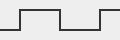
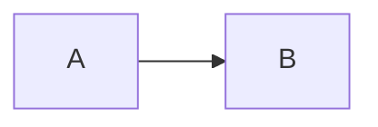

---
press:
  declare:
    counters:
      fw:
        name: Finding
        format: "FW-{n:02d}"
    glossary:
      watchdog: A timer that resets the board when the firmware stops kicking it.
---

# Every construct

One row of the per-construct table of `specs/migration/web-profile.md` per
section: the site shows what `tmark.lower_web` splices in, the PDF what the
LaTeX writer prints from the same source.

## Counters {#sec:counters}

The first finding is #(fw:watchdog) and the second is #(fw:ota). A silent
item sits on the next heading. See @fw:watchdog, @fw:ota, @[fw:watchdog; fw:ota]
and the site-wide @req:reset declared in `mkdocs.yml`.

### Log buffer wiped {#fw:log-wrap}

Referenced as @fw:log-wrap; the section as @sec:counters. A textual link
[stays as written](#fw:watchdog).

## Figures



Figure: The watchdog trace. {#fig:trace}

::: figure {cols=2}
{#fig:left}
{#fig:right}

Figure: Two views of the same trace. {#fig:views}
:::

See @fig:trace, @fig:left and @[fig:trace; fig:views].

## Tables

| Id | Finding |
| --- | --- |
| #(fw:table) | Defined in a table cell. |

Table: Findings by id. {#tbl:findings}

```yaml table
columns: [Key, Value]
rows:
  - ["Cell **bold**", "Cell two"]
  - ["Cell three", "Cell four"]
```

Table: A structured table. {#tbl:yaml}

See @tbl:findings and @tbl:yaml.

## Listings and equations

```python
print("hello")
```

Listing: A greeting. {#lst:hello}

$$
E = mc^2
$$ {#eq:einstein}

See @lst:hello and @eq:einstein.

## Callouts

!!! note "Kept as written"
    A Material admonition passes through.

::: warning {title="Careful"}
A TMark callout with @fw:watchdog inside.
:::

::: theorem {#thm:one title="Pythagoras"}
$a^2 + b^2 = c^2$.
:::

::: note {collapsed=true}
Collapsed on the site, a callout in print.
:::

See @thm:one.

## Asides, index and glossary

::: aside
A block aside: a margin note in print, a floating note on the site.
:::

A sentence with {aside side=left}[an inline aside], an index entry
{index}[watchdog][timer] (search for "timer") and a glossary term
@gls:watchdog.

## Inline roles

{sc}[Small caps], __also small caps__, {keys}[ctrl+s], {mark}[marked],
{del}[deleted], H{sub}[2]O, x{sup}[2], {code python}[print()],
{underline}[underlined] and [a span]{#span-id .custom lang=fr}.

{raw html}(<b>Raw HTML: only the site sees this sentence.</b>)
{raw latex}(\textbf{Raw LaTeX: only the PDF sees this sentence.})

[This paragraph is web-only.]{media=web}
[This paragraph is print-only.]{media=print}

::: note {media=print}
A callout only the PDF carries.
:::

## Passthrough

Material's own syntax is untouched: ++ctrl+alt+del++, ==marked==,
:material-check:, a tab set and a `mermaid` fence.

=== "Tab one"

    First tab.

=== "Tab two"

    Second tab.



::: pkg.module
    handler: python
    options:
      show_source: false

After the unclosed mkdocstrings-style directive, @fw:ota still resolves.
