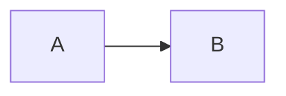

# TMark — TeXSmith Markdown

> Draft 2 — consolidated specification proposal.
> Status: working draft. Normative wording ("MUST", "SHOULD") is aspirational
> until the conformance suite exists. Constructs marked *(proposed)* are not
> implemented in TeXSmith yet; everything else describes shipping behaviour.

TMark is the Markdown dialect understood by TeXSmith. It is a curated,
opinionated stack: CommonMark structure, the Python-Markdown/PyMdownX
extension family that MkDocs users already know, and a small set of TeXSmith
constructs that close the gaps academic and technical writing actually has —
references, citations, numbering, captions, rich tables, and controlled
escape hatches to the backends.

Markdown was never designed for scientific documents. TMark does not try to
fix Markdown; it defines a *canonical subset with sugar*: every feature has
exactly one canonical representation in the document model, and zero or more
sugar spellings that normalise to it. This is what makes linting, formatting
and round-tripping possible, and what keeps the syntax surface small even
though the feature list is long.

## 1. Philosophy

**P1 — Content, not form.** The body carries meaning; templates, fragments
and front matter carry appearance. TMark deliberately has no syntax for font,
size, colour, borders or highlight stripes (unlike, say, Typst's
`highlight(stroke: …)`). One bold, one emphasis, one small caps — a template
decides what they look like. When a document needs a new *kind* of thing
(a "Finding", a "Solution" callout), it declares the kind in front matter and
uses it semantically in the body.

**P2 — Canonical form + permissive input.** TMark accepts the common
spellings of the Markdown jungle (GFM-ish tables, PyMdownX admonitions,
Pandoc-style caption lines) but defines, for each feature, a single canonical
form. A formatter (`tmark fmt`, roadmap) rewrites any accepted spelling to the
canonical one. Sugar is for fingers; canonical is for tools.

**P3 — Graceful degradation.** A TMark file pasted into GitHub or any
CommonMark renderer should stay *readable*. Every construct is classified
(see §3): identical, readable-degraded, or meaning-changed. Meaning changes
are few, deliberate, and listed exhaustively.

**P4 — Explicit over magic.** No network fetches, no implicit content
generation unless a feature is switched on (DOI resolution, Wikipedia
glossaries, script-generated figures are all opt-in and declared).
Diagnostics are loud: an unresolved reference renders visibly as `[?key]`,
never silently disappears.

**P5 — Backend symmetry.** Every construct must be expressible in LaTeX,
Typst and HTML. A construct that only one backend can honour belongs in a raw
passthrough block, not in TMark proper.

**P6 — One mechanism per job.** Where TeXSmith historically grew two
spellings for one feature (index entries, captions, citations), this spec
picks one canonical form and demotes the other to a compatibility alias with
a deprecation horizon.

## 2. Document model

A TMark document is front matter (YAML) plus a body. The body parses into a
typed intermediate representation (IR); backends render the IR. The IR — not
any concrete syntax — is the definition of TMark. The canonical serialization
of the IR back to TMark text is the *normal form*; `tmark fmt` (roadmap)
emits it, and round-tripping means `parse → IR → print → parse` is a fixed
point.

Beyond core CommonMark structure (headings, paragraphs, lists, quotes,
emphasis, links, images, fenced code), TMark adds exactly four syntactic
families. Everything in this spec is an instance of one of them:

1. **Attributes** — `{#id .class key=val}` attached *after* an element
   (`attr_list`). Attributes decorate an existing node.

   ```md
   ## Boot sequence {#sec:boot}
   {width=60%}
   ```

2. **Roles** — `{name arg key=val}[content]` inline, the name *before* the
   content. Roles create semantic inline nodes.

   ```md
   {index}[endianness]  {margin}[see Prandtl 1921]  {latex}[\clearpage]
   ```

   Disambiguation with attributes is syntactic: an attribute block starts
   with `#`, `.` or contains `=` on a known key position; a role head is a
   bare identifier. A role not followed by `[` is literal text.

3. **Container directives** — a fenced block whose content is Markdown:

   ```md
   ::: figure {#fig:pair cols=2}
   ...markdown content...
   :::
   ```

   Canonical fence is `:::` *(proposed — aligns with Pandoc, Djot, MyST,
   markdown-it-container)*. The PyMdownX spellings `/// name … ///` and
   `!!! type "Title"` (admonitions) are accepted sugar and remain fully
   supported; `!!!` stays the recommended spelling for callouts because
   MkDocs Material renders it natively.

4. **Data directives** — a fenced *code* block whose info string is
   `<lang> <directive>`, holding opaque or structured non-Markdown content:

   ````md
   ```yaml table
   columns: [A, B]
   rows: [[1, 2]]
   ```
   ````

   The pattern generalises: `yaml table`, `yaml table-config`, `grid table`,
   `python image`, `latex render`. Degradation is excellent — any other
   renderer shows a plain code block.

The split between 3 and 4 is a rule, not an accident: **containers hold
Markdown, fences hold data**. A figure group is a container; a table
description, a diagram source or a raw LaTeX payload is data.

Headings, lists and paragraphs are *not* re-expressible as roles or
directives. Draft 1 claimed a document could be written with two primitives
only (`{heading 1}[Foo]`); that purity is dropped — it conflated inline and
block grammar and duplicated syntax nobody would use. CommonMark structure is
the substrate, the four families extend it. (MyST and reST make the same
choice: nobody writes headings as directives.)

### Sigil map

TMark reserves three inline sigils with consistent meaning:

| Sigil | Meaning | Constructs |
| ----- | ------- | ---------- |
| `@`   | **refer to** something | `@label`, `@[fig:x]`, `@key` (citation), `@alias:fw:item` (cross-document) |
| `#`   | **define** something   | `{#id}` anchors, `#{n:key}` counter items, `#[term]` index entries |
| `^`   | **note**               | `[^1]` footnotes, `^[key]` citation sugar, `^sup^` |

"`#` defines, `@` refers" is the mnemonic the whole reference system hangs on.

## 3. Conformance and deviations

Every construct carries a degradation class:

- **C (compatible)** — renders identically in CommonMark/GFM.
- **D (degrades)** — foreign renderers show something readable but unstyled
  (a code block, a literal `!!! note` line, a `Table:` paragraph).
- **X (diverges)** — the same bytes *mean something else* in GFM. These are
  the dangerous ones; the list below is exhaustive and normative.

| # | Syntax | GFM meaning | TMark meaning | Rationale |
| - | ------ | ----------- | ------------- | --------- |
| X1 | `__text__` | bold | small caps | `__` duplicates `**`; academic writing needs small caps far more than a second bold. Same recycling logic gave Markdown `~~`, `==`, `^`. |
| X2 | `---` (thematic break) | horizontal rule | page break (paged media) | See §6.2 — semantically it stays a *divider*; paged templates map it to `\clearpage` by default. |
| X3 | `^x^` / `~x~` | literal | superscript / subscript | PyMdownX caret/tilde; long-established in the MkDocs world. |
| X4 | `@word` | literal | cross-reference | Guarded: never fires inside e-mails, URLs, or code; `\@` escapes. |
| X5 | `#[term]`, `#{n:key}` | literal | index entry, counter item | Guarded: `#{…}` is inert unless the prefix is declared, protecting Ruby-style interpolations. |

A conformant TMark processor MUST implement classes C and D and MUST document
which X-deviations are active. A future `strict` profile may disable X1/X2
for teams that co-render sources on GitHub.

## 4. Front matter

YAML island at line 1, fenced by `---`. Typographic configuration lives under
`press:`; document metadata (`title`, `authors`, `date`) at the root or under
`press:`. Knowledge bases each get their own top-level key:

```yaml
---
title: Firmware Review          # omitted → first heading is promoted
authors: [{name: Ada Lovelace, affiliation: Analytical Engine}]
date: 2025-03-15                # ISO date | string | "commit"
id: RHE-423                     # document identifier for cross-doc citations
press:
  template: book                # article | book | letter | user template
  base_level: chapter           # what a top-level `#` maps to
  callout_style: fancy          # fancy | classic | minimal
  code: {engine: pygments}
  slots: {abstract: Abstract}
bibliography: {…}               # §9
glossary: {…}                   # §10
acronyms: {…}                   # §10
counters: {…}                   # §8.3
crossrefs: {…}                  # §8.4
admonitions: {…}                # §11.3
epigraph: {…}                   # §17
---
```

All sections are validated (pydantic); unknown keys fail at parse time, not
in the PDF.

## 5. Headings and structure

`#` … `######`, six levels, never manually numbered. TeXSmith aligns messy
multi-file hierarchies automatically: per-fragment offset from the shallowest
heading, plus the template slot base, plus `base_level`. The first heading is
promoted to the document title unless a `title:` is declared
(`--no-promote-title` / `title: null` opt out). This machinery is a TeXSmith
processing concern, not TMark syntax; the syntax rule is only: *headings are
relative, the template anchors them.*

## 6. Blocks

### 6.1 Paragraphs, quotes, lists

CommonMark. Blockquotes with `>`; unordered (`-`) and ordered (`1.`) lists
nest by indentation; `pymdownx.fancylists` markers are accepted. Task lists:

```md
- [ ] Unchecked
- [x] Checked
```

`- [.]` "partial" *(proposed)* is class D (renders as literal `[.]` on
GitHub) and off by default; feature `tasklist.partial`.

Definition lists (`def_list`), class D:

```md
Term
:   Definition, indented continuation lines aligned.
```

Footnotes, class C:

```md
A sentence with a footnote.[^1]

[^1]: The footnote text.
```

Footnotes should stay one line in print.

### 6.2 Thematic break = page break

`---` on its own line (blank lines around it) is a *divider* node. Paged
backends (LaTeX, Typst) render it as a page break by default; HTML renders
`<hr>`. A template may restyle it (e.g. a fleuron instead of `\clearpage`) —
the mapping is form, the divider is content. This resolves draft 1's
"recycled page break" more honestly: the *syntax* keeps its CommonMark
semantics ("section divider"), only the default paged rendering is opinionated.

There is no line-break role: Markdown's hard break (trailing `\`) already
exists. A backend-specific break is an escape hatch: `{latex}[\newpage]`.

## 7. Inline markup

Canonical role, sugar, and backend mapping:

| Feature | Sugar | Canonical role | LaTeX |
| ------- | ----- | -------------- | ----- |
| Emphasis | `*x*` or `_x_` | — (core) | `\emph` |
| Strong | `**x**` | — (core) | `\textbf` |
| Strong emphasis | `***x***` | — (core) | nested |
| Small caps | `__x__` (X1) | `{sc}[x]` | `\textsc` |
| Strikethrough | `~~x~~` | `{del}[x]` | `\sout` |
| Subscript | `~x~` | `{sub}[x]` | `\textsubscript` |
| Superscript | `^x^` | `{sup}[x]` | `\textsuperscript` |
| Highlight | `==x==` | `{mark}[x]` | `\hl` |
| Underline | — (none, deliberate) | `{underline}[x]` | `\underline` |
| Keystrokes | `++ctrl+s++` | `{keys}[ctrl+s]` | ts-keystrokes |
| Inline code | `` `x` `` | — (core) | engine-dependent |
| Highlighted inline code | `` `#!py print(1)` `` | `{code py}[print(1)]` | engine-dependent |

Notes:

- Draft 1 assigned `__` to underline; that contradicted the shipping
  implementation (small caps) and promoted a construct that print typography
  discourages. Underline exists only as an explicit role, no sugar.
- `^^x^^` (caret "insert") is dropped from the canonical set — it collided
  with small caps in the old docs and has no print semantics. Feature flag
  `inline.insert` can re-enable it as `<ins>`/underline for HTML-first users.
- Critic markup, emoji, smart symbols (`(c)`, `(tm)`, `-->`), SmartyPants
  quotes/dashes and magic links remain accepted (class C/D) and normalise to
  IR nodes, not to syntax of their own.
- A standalone paragraph consisting of one short bold span (< 80 chars) is
  promoted to a lead-in pseudo-heading (`\tslead`). Purely a rendering rule —
  no syntax involved.

### 7.1 Math

`$…$` / `\(…\)` inline, `$$…$$` / `\[…\]` display. Content is LaTeX math
(MathJax-compatible); the Typst backend translates it. No space directly
after the opening delimiter.

Numbered equations, canonical *(proposed)*: attach an anchor to the display
block, Quarto-style —

```md
$$
a^2 + b^2 = c^2
$$ {#eq:pythagoras}

From @eq:pythagoras we conclude…
```

Compatibility: `\begin{equation}\label{eq:x}…` inside `$$` and `$\eqref{…}$`
keep working (class D, LaTeX-flavoured). Draft 1's `!!! equation #id` is
rejected: admonitions are callouts, not math wrappers, and the attr-anchor
form is lighter and proven by Quarto.

## 8. Anchors, references, numbering

### 8.1 Anchors — `#` defines

Any element takes an id through attributes: `## Title {#sec:intro}`,
`{#fig:trace}`, caption lines (§8.5). Reserved prefixes route
the anchor to the right counter and label word:

```
sec  fig  tbl  eq  lst  app  chap  part  note  gls
```

(One canonical prefix each — draft 1's single-letter aliases `f`/`t`/`l`/`e`
are dropped: they polluted the namespace for zero keystrokes saved.)

### 8.2 References — `@` refers

```md
@[sec:intro]      bracketed, any label
@sec:intro        bare, one word of [A-Za-z0-9_:.-]
[](#sec:intro)    empty-link form (compat with pure-Markdown toolchains)
[](other.md)      section number of another document's main heading
```

A reference renders the locale-correct label and number ("Figure 3",
"figure 3", "Abbildung 3") as a hyperlink. Trailing sentence punctuation
stays out of bare labels; `\@` forces a literal `@`; e-mails and URLs never
match. Never hardcode "Figure 3", and never write "above"/"below" — floats
move in print.

### 8.3 Custom counters

Series LaTeX knows nothing about (requirements, findings, risks):

```yaml
counters:
  fw: {name: Finding, format: "FW-{n:02d}", start: 1}
```

```md
#{fw:boot-loop} The firmware reboots when the watchdog fires.   ← define + print
## Boot loop {#fw:boot-loop}                                    ← define silently
The watchdog issue (@fw:boot-loop) is fixed in 1.4.2.           ← refer
```

Undeclared prefixes stay literal text (protects `#{user.name}`
interpolations); duplicates and dangling references warn loudly. Numbers are
allocated in document order across a multi-document build.

### 8.4 Cross-document references

Each conversion publishes a JSON inventory (`doc.refs.json`: keys, formatted
labels, pages). A citing document declares aliases and uses a three-segment
reference:

```yaml
crossrefs:
  fwrev: build/firmware-review.refs.json
```

```md
See @fwrev:fw:pas-de-temps.        → "RHE-423-FW-10 p. 14" (plain text, not a link)
```

Resolution is explicit — an alias never falls back to a local counter.
Stale or missing inventories warn; unresolved citations render visibly as
`[?fwrev:fw:x]`.

### 8.5 Captions — one pattern for all

Canonical: a **caption line** adjacent to the block, `Kind: text {#id}`:

```md
Table: Fruit stock by warehouse. {#tbl:stock}

| Fruit | Geneva | Zurich |
| ----- | ------ | ------ |
| …     | …      | …      |
```

`Table:` is implemented today; `Figure:` and `Listing:` *(proposed)* extend
the same pattern to images and code fences:

```md
{width=70%}

Figure: Full caption, with **Markdown**, shown under the figure. {#fig:plot}
```

Rules:

- The image `alt` text is the short caption (list of figures); the caption
  line is the long one.
- An image with a caption or an anchor is *promoted* to a numbered float;
  a bare image stays inline.
- The PyMdownX `/// caption` + `attrs: {id: …}` block remains accepted
  (class D) but is demoted to compatibility: its id-with-colon restriction
  (`fig:x` is rejected by pymdown-extensions and the block silently degrades)
  directly contradicts the reserved-prefix convention, which is exactly the
  kind of trap a canonical form must not have.

## 9. Citations and bibliography

Sources: `.bib` files passed on the CLI, and/or front matter entries
(pybtex-shaped YAML, or a DOI the resolver expands — opt-in network):

```yaml
bibliography:
  ein05: https://doi.org/10.1002/andp.19053221004     # DOI shorthand
  AI2027: {type: misc, title: AI 2027, authors: [Daniel Kokotajlo], date: 2025-04-03}
```

Citing, canonical *(proposed — unification)*:

```md
Time is relative @ein05, and recent work agrees @[ein05, KOFINAS2025].
```

`@key` resolves in order: local label → counter → bibliography key; an
ambiguous key (both a label and a bib entry) is a hard warning. This is
exactly Typst's model (one `@` for labels and citations) and Pandoc's
spelling. The shipping syntax `[^key]` / `^[key1,key2]` (citations as
footnotes) remains accepted sugar; the footnote-vs-citation shadowing rule
(a real footnote with the same key wins) is preserved but linted against.

Rejected from draft 1: inline DOI citation `@https://doi.org/…` — the `@`
matcher deliberately never fires on URLs (X4 guard), and a raw DOI in running
text is noise. Declare the DOI once in front matter under a readable key.

## 10. Glossary, acronyms, index

**Acronyms** (PHP-Markdown-Extra `abbr`, class C):

```md
The HTML spec is maintained by the W3C.

*[HTML]: HyperText Markup Language
*[W3C]: World Wide Web Consortium
```

Substitution is strict and case-sensitive, applies only to defined keys, and
maps to `glossaries`' `\acrshort`. Structured declaration (groups, per-group
tables) lives in front matter under `glossary:`/`acronyms:`.

**Glossary references**, canonical *(proposed)*: `@gls:term` — a glossary
entry is a referenceable object like any other, so it uses the `@` sigil and
the reserved `gls` prefix. `[](gls:term)` (fake URL scheme) is demoted to
compatibility: it invented a third reference mechanism for no gain.

Wikipedia-backed glossary entries (auto-fetch summaries from
`[SOLID](https://en.wikipedia.org/wiki/SOLID)` links) are opt-in:
`glossary.wikipedia: true`. Off by default (P4).

**Index entries**, canonical: the hashtag form —

```md
#[endianness]                one level
#[byte order][endianness]    nested (max 3)
#[**chocolate**]             bold page number (main topic)
{index:physics}[relativity]  target a named registry
```

`#[…]` fits the sigil map (`#` defines) and is the short, common case; the
`{index}` role remains for named registries and is the canonical IR spelling.
Both are one feature — draft 1 documented them as two.

## 11. Admonitions

### 11.1 Callouts

```md
!!! warning "LaTeX toolchain"
    Install TeX Live, MiKTeX or MacTeX before `texsmith --build`.
```

Types: `note tip warning important danger info hint seealso question
abstract`. Rendered as `tcolorbox`; global style via `press.callout_style`
(`fancy | classic | minimal`). `!!!` is the recommended spelling (MkDocs
Material renders it); `::: note {title="…"}` is the canonical container form.

### 11.2 Foldable callouts

`??? type "Title"` (collapsed) / `???+` (open). Print has no folding, so the
strategy is declared per document (`press.details`):

- `expand` (default) — render expanded.
- `reference` — move the body to a grouped end-section ("Solutions",
  "Warnings"…) and replace it in place with a "See page N" link.

### 11.3 Custom admonition types

```yaml
admonitions:
  solution:
    name: Solution
    icon: "🎓"
    color: "#123456"        # quote it — a bare # starts a YAML comment
    group: Solutions        # section title under the `reference` strategy
    reference: "See page {page} for the solution"
```

This is P1 at work: new *kinds* are declared once, used semantically.

### 11.4 Theorem environments

`theorem`, `lemma`, `corollary`, `proof`, `definition` are admonition types
with numbering and LaTeX `amsthm` mapping:

```md
!!! theorem "Pythagorean Theorem" {#thm:pythagoras}
    For a right triangle, $x^2 + y^2 = z^2$.
```

Referenced with `@thm:pythagoras`.

## 12. Figures and images

### 12.1 Single images

```md
{width=60%}
```

Promotion to a numbered figure: add an anchor and/or a `Figure:` caption line
(§8.5). Attributes: `width`, `align`, plus per-format options (e.g. draw.io
`crop=false`).

### 12.2 Subfigures *(proposed)*

A container directive; images become subfigures; the **last paragraph is the
caption** (pandoc-crossref convention):

```md
::: figure {#fig:traces cols=2}
{#fig:boot}
{#fig:crash}

Watchdog traces before and after the fix.
:::
```

Renders "Figure 1" with "(a)", "(b)"; `@fig:crash` yields "Figure 1b".
Layout via `cols=`/`rows=`.

### 12.3 Diagrams

````md

````

plus `` and `{width=60%}` — the
extension recognises the source format and converts to vector PDF at build
time (mermaid-cli/Docker, draw.io export with `crop` control). Mermaid Live
`pako:` URLs are supported.

### 12.4 Generated figures *(proposed)*

A data directive: the fence executes and its output (stdout image or saved
file) becomes the figure. Sandboxed, opt-in (`figures.exec: true`), Python
first:

````md
```python image
import matplotlib.pyplot as plt, sys
plt.plot([1, 2, 4, 8])
plt.savefig(sys.stdout.buffer, format="pdf")
```
````

Combine with `include="script.py"` to keep sources external. Precedent:
Quarto/Jupyter executable cells; degradation: a plain code block (class D).

## 13. Tables

A power ladder — use the lowest rung that fits:

1. **Pipe table** (GFM): quick 2-D data, per-column alignment.
2. **+ caption line**: `Table: caption {#tbl:x}` above the table.
3. **+ `yaml table-config`** fence after the table: positional column layout
   (width, `X` flexible columns, justify) without touching the data.
4. **`grid table`** *(proposed rename of "ascii table")*: reST/Pandoc-style
   grid syntax in a fence for moderate spans — the fence keeps foreign
   renderers showing tidy monospace:

   ````md
   ```grid table
   Long table caption {#tbl:grid}

   +-----+-----+-----+
   |  1  |  2  |  3  |
   +=====+=====+=====+
   |        4  |     |
   +-----+-----+  5  +
   |  6  |  7  |     |
   +-----+-----+-----+
   ```
   ````

5. **`yaml table`** fence: the fully structured form — grouped headers
   (recursive `columns:`), row/col/rectangular spans (`{value, rows, cols}`
   with `~` acknowledging absorbed slots), separators with labels, footers,
   named-row mode with typo detection, width groups, `long`/`placement`.
   Validated before rendering; errors are inline and local.

Removed from draft 1: `>>>` / `vvv` span markers inside pipe tables, and
"empty cell propagates the span". Magic tokens inside cell data collide with
legitimate content, and empty cells are far too common to carry meaning.
Spans begin at rung 4; pipe tables stay dumb on purpose.

Decimal alignment: right-aligned columns whose cells are all numeric align on
the decimal point. Feature `table.decimal-align` *(renamed from
`numbers-to-dot`)*, on by default.

Inline Markdown survives inside cells in all forms; quote YAML-hostile values.

## 14. Code listings

````md
```python title="bubble_sort.py" linenums="1" hl_lines="2-3"
def bubble_sort(items): ...
```
````

Options: `title`, `linenums`, `hl_lines`, `include="file"` *(proposed
unification of external sources — today `--8<--` snippets do this)*.
Engines (global, `press.code.engine`): `pygments` (default, Tectonic-safe) |
`listings` | `verbatim` | `minted` (needs shell escape). Inline spans follow
the engine; long inline code wraps per `press.code.inline: {breaks, plain}`.

Referenceable listings: `Listing: caption {#lst:x}` line *(proposed)*,
referenced with `@lst:x`.

## 15. Raw passthrough

Escape hatches are explicit, backend-tagged, and invisible to other backends:

| Form | Syntax |
| ---- | ------ |
| Inline | `{latex}[\clearpage]` — also `{typst}[…]`, `{html}[…]` |
| Block (container) | `/// latex … ///` (shipping) |
| Block (data fence) | ```` ```latex render```` — also `typst render`, `html render` *(proposed)* |

A `latex render` fence is ignored by the Typst and HTML backends, and vice
versa — which is precisely how one document targets three outputs. The fence
form is canonical (opaque payload ⇒ data directive, §2); `/// latex` remains
as sugar.

## 16. Includes

```md
--8<-- "includes/chapter.md"
```

PyMdownX snippets, kept as-is (the syntax is odd but established, and it
degrades to a visible marker). Fenced code takes `include="file"` instead of
inlining content. Included Markdown is pasted verbatim by default; `resolve`
options for rebasing relative links/images are a tooling concern on the
roadmap. Draft 1's `{include}[file.md]` role is dropped — a third include
spelling with block-level semantics in inline position.

## 17. Margins, epigraphs, and small comforts

**Margin notes** — inline role, optional side argument:

```md
Hooke's law{margin}[linear only at small strain] holds below the yield point,
but non-linear effects{margin left}[see **Prandtl 1921**] dominate above it.
```

Canonical side spelling is `{margin left}` / `right` / `outer` / `inner`
*(proposed)*; the shipping single-letter suffix `{margin}[…]{l}` stays as
sugar. Block form for longer asides:

```md
::: margin
A **marginal note** attached to the preceding paragraph.
:::
```

Width, font-size clamping and geometry awareness are the `ts-extra`
fragment's problem, not syntax.

**Epigraphs** — front matter (`epigraph: {quote, source}`) or a blockquote
tagged `{.epigraph}`.

**Progress bars** — `[=75% "Review"]` (+ `.thin`), PyMdownX-compatible.

**Wiki links** — `[[Page Title|label]]` resolve to project files.

## 18. Extensibility

- **Feature registry.** Every feature has a dotted name
  (`table.decimal-align`, `tasklist.partial`, `glossary.wikipedia`,
  `figures.exec`, `details.strategy`) and a switch in front matter or
  configuration. The spec's feature list *is* the registry.
- **Fragments** supply backend assets (`ts-code`, `ts-extra`,
  `ts-callouts`, …) and are auto-loaded on first use of their constructs.
- **Custom sugar.** User-defined inline/block syntax is explicitly out of
  scope for now. MkDocs' history shows parser-level plugins breeding
  conflicts; the supported extension points are: custom admonition types
  (§11.3), custom counters (§8.3), templates/fragments, and the documented
  `@reads`/`@writes` IR hooks in TeXSmith's Python API.

## 19. Tooling roadmap

1. **Canonical printer** (IR → TMark normal form) — the prerequisite for
   everything below.
2. **`tmark fmt`** — normalise sugar to canonical (or a chosen sugar
   profile); stable diffs.
3. **`tmark lint`** — line/column diagnostics: unresolved references,
   shadowed citation keys, X-class constructs in strict mode, hardcoded
   "Figure N", "above/below" wording, caption ids off-convention.
4. **Dialect import** — GFM/MyST/Pandoc admonitions and crossrefs rewritten
   to TMark canonical form.
5. **VS Code extension** — grammar + front-matter schema completion +
   outline + preview (HTML fast path, PDF via Typst).
6. **MkDocs/Zensical parity** — every TMark feature either renders on the
   site (companion plugins: counters, index/tags) or degrades to class D.
   One source, web and print.

## Appendix A — Divergences from draft 1

| Draft 1 | Draft 2 | Why |
| ------- | ------- | --- |
| Two universal primitives, `{heading 1}[x]` | Four families over a CommonMark substrate | False purity; conflated inline/block; nobody writes headings as roles. |
| `__x__` = underline | `__x__` = small caps (X1), underline role-only | Matches the shipping implementation; underline is poor print typography. |
| `---` "recycled into page break" | Divider node; paged templates render `\clearpage` | Same behaviour, honest semantics — the mapping is form, not syntax. |
| `!!! equation #id` | `$$ … $$ {#eq:id}` | Admonitions are callouts; attr anchors are lighter (Quarto-proven). |
| Citations `@https://doi.org/…` | DOI declared in front matter, cite `@key` | `@` never fires on URLs; keys keep prose readable. |
| `[](gls:solid)` | `@gls:solid` | One reference mechanism; `gls` is just a reserved prefix. |
| `>>>` / `vvv` + empty-cell span propagation | Spans start at grid/YAML tables | Magic tokens in data; empty cells are too common to be meaningful. |
| "Ascii tables" | `grid table` fence | Aligns with reST/Pandoc terminology and syntax. |
| Ref aliases `fig`/`f`, `tab`/`t`, `eqn`/`e` | `fig tbl sec eq lst …` only | One spelling per prefix; matches the implemented reserved set. |
| `{include}[file.md]` role | `--8<--` + fence `include=` | No third include mechanism. |
| Footnote def `[1]: text` | `[^1]: text` | Draft typo. |

## Appendix B — Open questions

1. **Citation locators** — `@[ein05, p. 33]`? Pandoc's locator grammar is
   powerful and messy; Typst passes a supplement argument. Undecided.
2. **`:::` parser** — implement a colon-fence container extension, or keep
   `///`/`!!!` as the only concrete spellings and reserve `:::` for the
   normal form once the printer exists?
3. **Stable counter pinning** — explicit `=FW-07` pinning to survive
   renumbering in contractual documents (draft: warning-only today).
4. **Listing anchors** — `Listing:` caption line vs fence attribute
   `{#lst:x}`; pick one before implementing.
5. **Strict profile** — exact contents (disable X1/X2 only, or all X?),
   and whether `tmark fmt` can translate between profiles losslessly.
6. **Theorem numbering** — share the equation counter (Springer style) or
   independent series per type?
