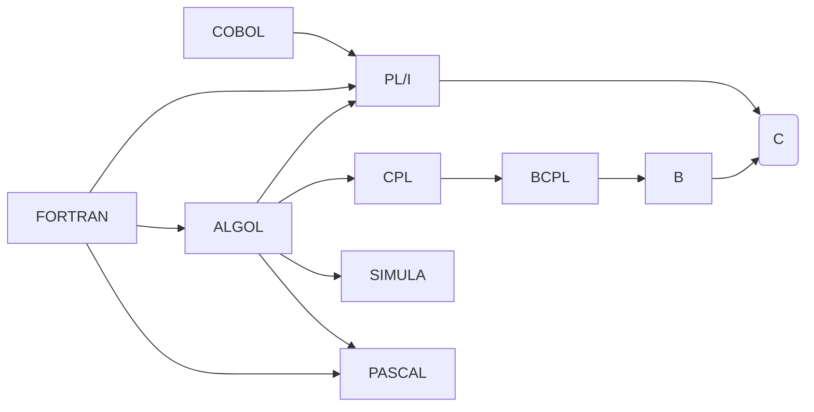

# MkDocs test document

## Plain **Markdown** *Features*

Lorem *ipsum* dolor **sit** amet, *consectetur **adipiscing** elit*.

Maecenas ac _rutrum_ est, vitae dapibus dui. Nunc at dolor libero. Quisque volutpat malesuada tellus ac luctus. Phasellus tempus ullamcorper nulla, eget cursus purus luctus ut. Integer fermentum purus at volutpat malesuada. Suspendisse sit amet dui erat. Sed id gravida justo. Vestibulum pharetra dolor ipsum, facilisis ullamcorper tellus pulvinar in. Vivamus vitae mauris id ipsum mollis consequat quis eget magna. Phasellus fermentum felis in tellus consequat posuere. Curabitur commodo pellentesque ante, eget efficitur ipsum gravida vitae. Suspendisse porta iaculis metus at tincidunt.

>Vivamus non interdum quam, a consectetur odio. In sit amet quam vitae ipsum dignissim eleifend. Donec iaculis libero nunc, nec vulputate erat efficitur at. Morbi aliquet augue et mollis vestibulum. Etiam varius sed felis ut mollis.

### Lists

Vivamus ut nulla nunc. Curabitur et justo arcu. Etiam luctus nibh vel dui posuere, vitae venenatis lorem pellentesque. Pellentesque viverra fermentum orci et viverra.

- Item 1
  - Subitem *1a*
  - **Subitem** 1b
- Item 2
  - Subitem *2a*
    - Subsubitem 2a.i
    - Subsubitem 2a.ii
- Item 3

Phasellus dictum tellus ac ultrices ultrices. In finibus orci augue, eu bibendum tortor sollicitudin eget. Sed sed maximus ex, ac eleifend lorem.

1. First
   1. First subitem
   2. Second subitem
2. Second
3. Third

### Code

Here is a simple Python function:

```python
def greet(name):
    print(f"Hello, {name}!")
```

Here a is some inline code: `print("Hello World!")`.

---

### Links

You can visit the [MkDocs website](https://www.mkdocs.org/) for more information.

### Images


### Definition Lists

Apple
:   A sweet fruit, *typically* red or green.

Banana
:   A long yellow **fruit** rich in potassium.


### Tables

| Syntax | Description |
| ----------- | ----------- |
| Header | Title |
| Paragraph | Text |

### Footnotes

Here's a sentence with a footnote. [^1]

[^1]: This is the footnote.

### Heading Level 3

#### Heading Level 4 {#custom-id}

Cras rhoncus ornare tellus, auctor semper tortor auctor id. Pellentesque habitant morbi tristique senectus et netus et malesuada fames ac turpis egestas. Sed commodo nulla sit amet leo tincidunt dapibus. Praesent placerat viverra dolor nec commodo. Aenean eu sodales erat, eu posuere elit.

##### Heading Level 5

In id augue eu nibh efficitur aliquam. In posuere ex nec mi tincidunt, et tempus odio pellentesque. Nulla vitae magna leo. Donec ultricies quam et lectus tempor, sed mattis eros vehicula.

## Extended Syntax

### Formatting Features

Vivamus non interdum quam, a ~~consectetur odio~~. In sit amet quam vitae ipsum dignissim eleifend. Donec iaculis libero nunc, nec ==vulputate erat efficitur== at. Morbi aliquet augue et mollis vestibulum :joy: . Etiam varius sed felis ut mollis. H~2~O is water. X^2^ is X squared.

## Drawio


## Mermaid



## Admonitions

Admonitions allow highlighting different types of information:

!!! note "A Simple Note"
    This is a simple note admonition.

!!! info "Information Box"
    You can include additional information like this.

!!! warning "Warning"
    Be careful when editing the configuration file!

!!! success "Success"
    Congratulations — your MkDocs Material setup works!

## Pymdown Extensions

### Smart Symbols (`pymdownx.smartsymbols`)

Adds smart typography: 1/2 → ½, (c) → ©, (tm) → ™.

### Critic Markup (`pymdownx.critic`)

==Added text==
~~Deleted text~~
{++Inserted++} and {--Removed--} content.
{>>This is a comment<<}

### Blocks and Details

???+ note "Expandable Section"
    Click to expand this section.
    It uses `pymdownx.details` to hide or show details interactively.

### HTML Blocks

<div style="background:#f0f0f0;padding:10px;border-radius:8px">
This block is written directly in **HTML** inside Markdown using `md_in_html`.
</div>

### Task List (`pymdownx.tasklist`)

- [x] Install MkDocs
- [x] Install Material theme
- [ ] Write amazing documentation

### Fancy Lists (`pymdownx.fancylists`)

1. First item
2. Second item
3. Third item with subitems
   a. Subitem A
   b. Subitem B

## Keyboard Keys (`pymdownx.keys`)

Press ++Ctrl+S++ to save your document.
Or use ++Cmd+Shift+P++ on macOS to open the command palette.

## Magic Links (`pymdownx.magiclink`)

You can automatically link URLs:
<https://www.mkdocs.org/>

And GitHub shorthand references:
`#42` → automatically links to an issue (if configured).

## Highlighting and Code Features

### Inline Highlight (`pymdownx.inlinehilite`)

Here’s some inline code with syntax highlighting: `#!python print("Hello World!")`

### Superfences

```python
def greet(name):
    """Demonstrates syntax highlighting"""
    print(f"Hello, {name}!")
````

```bash
# Example shell block
mkdocs serve
```

### Code Copy Button

Try hovering over the code block above — you’ll see a copy icon!

### Code Annotation (`content.code.annotate`)

```python
def compute(x, y):
    return x + y  # (1)
```

1. This line demonstrates code annotation support.

## Tabs (`pymdownx.tabbed` + `content.tabs.link`)

=== "Python"

````
```python
print("Hello from Python!")
```
````

=== "JavaScript"

````
```javascript
console.log("Hello from JavaScript!");
```
````

Tabs can be **linked** using `content.tabs.link`, keeping the same selection across pages.

## Emoji Support (`pymdownx.emoji`)

You can use emojis directly:
:rocket: :smile: :tada: :warning: :heart:

## Mark and Highlight (`pymdownx.mark`, `pymdownx.caret`, `pymdownx.tilde`)

==Highlighted text==
^^Inserted text^^
~~Strikethrough text~~

## Footnotes

This is a statement with a footnote.[^1]

[^1]: This is the text of the footnote.
